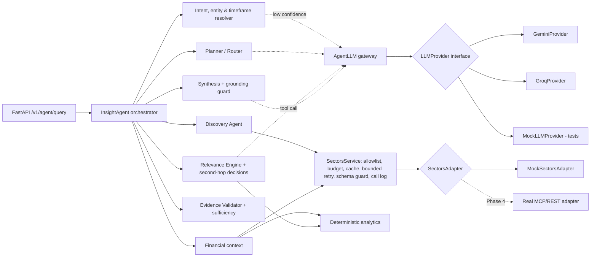

# IDX Insight Agent

An AI research and discovery assistant for Indonesian-listed companies, built on
[Sectors](https://sectors.app/) data for the SECTORS Hackathon 2026
(track: AI Agents & Assistants).

> **Core question:** *What should I pay attention to, and why does it matter?*

## Current Status

**Phases 0–4 implemented: the agent runs on real Sectors data** (mock data remains
for tests and offline development); Phase 5 (product UI) is in progress. See
[PHASE.md](PHASE.md) — the project is currently until Phase 5.

| Area | State |
|---|---|
| Agent Brain (resolution, planning, discovery, relevance, second-hop) | Implemented |
| Deterministic analytics, evidence validation and sufficiency assessment | Implemented |
| FastAPI backend | Implemented |
| Sectors data | Real v2 REST adapter with credit guardrails (verified live on 2026-09-27); fictional mock data for tests |
| Runtime LLM | Provider-agnostic interface with Gemini and Groq providers; default is rules-only (no LLM). Groq (`openai/gpt-oss-120b`) verified live on all LLM paths (evaluation 16/16 on 2026-09-27); Gemini verified live for synthesis only (other calls hit 503/429 during testing) |
| Languages | Indonesian and English, following the user's language |
| Evaluation | 17 mock cases (offline) and 8 structural real-data cases; real-data run 8/8 with Groq on 2026-09-27 |
| Final LLM provider/model | **Not decided** |
| Frontend (Next.js) | In progress — workspace UI connected to the agent API through a server-side proxy; example mode when no backend is configured (see [frontend/README.md](frontend/README.md)) |
| Deployment (Vercel) | Not started — Phase 5/6 |

## Project Purpose

Investors and analysts following IDX companies face a steady stream of
disclosures, corporate actions and quarterly reports. IDX Insight Agent helps
them decide what deserves attention and gives the factual financial context
behind it, with every claim traceable to Sectors data.

It is a research tool. It does **not** give buy/sell/hold recommendations and
does not trade.

## Product Concept

Our own design, inspired by two concepts in the official hackathon candidate
brief (it is not an official Sectors product or design):

- **Discovery** (inspired by the IDX Disclosure Calendar candidate): which
  disclosures and events matter for my watchlist, sector or timeframe?
- **Contextual analysis** (inspired by the Peer Lens for IDX Banks candidate):
  what does the relevant financial data show for these companies?

The agent links the two: discover what deserves attention, then investigate why
it matters using relevant contextual data.

## Agentic Workflow

The agent makes explicit, recorded decisions at each step:

0. **Detect the language** of the question (Indonesian or English); the whole
   briefing, including numbers (`23,5%` vs `23.5%`), follows it.
1. **Resolve** companies (tickers, aliases and watchlist, verified against
   Sectors with a bounded number of calls), sector, timeframe and intent.
   Ambiguous companies trigger a clarification question instead of a guess;
   vague timeframes use a documented default recorded as an assumption. The LLM
   is consulted for intent only when the rules are unsure.
2. **Plan**: choose steps for the intent (discovery, peer comparison or
   single-company context). The LLM may propose the plan; code accepts it only
   if every step is allowed, required steps are present and the order is valid.
3. **Discover** filings and corporate actions in scope, normalise them into
   events with evidence, and remove duplicates.
4. **Rank relevance** with deterministic rules (ownership-change size,
   transaction value, insider trades, dividend/AGM dates, event clusters, watchlist).
5. **Decide second-hop research** (hybrid): the two most material events are
   always researched; the LLM may add others through a
   `request_financial_context` tool call, choosing a fixed reason category
   (`dividend_capacity`, `ownership_shift`, `governance_decision`,
   `corporate_action_context`). Code enforces the guards (only listed events,
   per-request company cap, remaining tool budget, reuse). Without an LLM, a
   score threshold decides. Discovery and company-context plans always include
   the event steps unless the user explicitly asks for a plain list. Every
   decision is recorded with its reason, category and source (`llm` or `rules`).
6. **Analyse** deterministically: growth, spreads, peer medians and rankings,
   outliers, period alignment and unit normalisation.
7. **Validate evidence** for every claim, then **assess sufficiency**:
   `sufficient`, `partial` or `insufficient`, listing incomplete, conflicting,
   unavailable and malformed data separately.
8. **Synthesise** a briefing from accepted claims only: each finding states
   what happened and, for events, why it matters. An optional LLM narrative
   must cite accepted claim ids or data-gap ids in every sentence; code rejects
   the whole narrative if a sentence cites an unknown item, uses a number that
   is not in the items it cites, or contains advice or speculative language
   (for example "menandakan", "signals", "will rise").

Bounded recovery happens where the problem appears: at most one retry per
Sectors call, one widened filing window when results are empty, a prior-year
re-query for missing comparison quarters, a per-request tool-call budget, and a
cap of four LLM calls per request.

Example trace for *"Apa saja disclosure yang perlu saya pantau minggu depan untuk sektor perbankan?"* (rules-only mode):

```
Entities resolved → Intent resolved (discovery) → Timeframe resolved (2026-09-28 s/d 2026-10-04)
→ Plan selected (rules) → Discovery selected (7 companies) → Relevant events detected (7 of 9, 1 duplicate)
→ Second-hop analysis selected (rules): BBNI, BBRI, BRIS → Financial context retrieved
→ Evidence validated (sufficient) → Response synthesized
```

## Architecture



- **Dependency direction** (enforced by `tests/test_architecture.py`): the
  Agent Brain imports only the LLM interface and neutral types, never a
  provider module or vendor SDK, and reaches Sectors only through
  `SectorsService`.
- **State**: `AgentState` is explicit and serializable; it holds intent,
  entities, timeframe, plan, events, second-hop decisions, evidence, metric
  values, claims, the validation report and assessment, data gaps, recovery
  actions, Sectors tool calls, LLM call records and the trace.
- **Stateless requests**: each query gets its own `SectorsService`, LLM gateway
  and state, which keeps the backend compatible with serverless deployment on Vercel.

```
backend/
  idx_insight/
    agent/       orchestrator, resolvers, planner, discovery, relevance/second-hop,
                 financial context, analysis, validator, synthesis, recovery,
                 llm_gateway, prompts, state
    analytics/   numbers, periods, peers, events/relevance rules, metric catalog
    sectors/     adapter interface, schemas, mock adapter + fixtures, SectorsService
    llm/         provider interface, neutral types, errors, structured output,
                 Gemini and Groq providers, shared HTTP transport, mock provider
    api/         FastAPI app, request/response schemas, service layer
    config.py    environment-driven settings
  tests/
```

## Data Source

Sectors v2 REST API (https://docs.sectors.app/), the only market-data source
(confirmed by the Sectors team). The adapter maps one method to each endpoint the
agent uses; costs follow the official billing rules:

| Adapter method | Endpoint | Credits |
|---|---|---|
| `get_filings` | `GET /v2/filings/` | 1 per page |
| `get_corporate_actions_calendar` | `GET /v2/corporate-actions/` (whole market) | 1 per action type |
| `get_corporate_actions` | `GET /v2/company/corporate-actions/{symbol}/` | 1 |
| `get_quarterly_financials` | `GET /v2/financials/quarterly/{symbol}/` | 1 per quarter returned |
| `get_quarterly_financial_dates` | `GET /v2/company/get_quarterly_financial_dates/{symbol}/` | 1 |
| `get_company_report` | `GET /v2/company/report/{symbol}/` | 1 per section |
| `list_subsectors` | `GET /v2/subsectors/` | 1 |
| `list_companies`, `get_company_metrics` | `GET /v2/companies/` (screener) | 1 |

A 404 costs one credit and an empty result is billed like any success; 400,
401/403, 429 and 5xx are free. The agent therefore chooses the cheapest route:
one calendar call for a whole sector instead of one call per company, one
quarter at a time instead of five, only the report sections a metric needs, and
one screener call for NPL across all compared banks.

Metrics are computed only from Sectors fields: company-report ratios (ROA, ROE,
NIM, cost-to-income, CASA, LDR, CAR), growth and ratios from quarterly
financials, and the NPL ratio from screener fields (`non_performing_loan` ÷
`gross_loan`). Other requested metrics (e.g. BOPO) are reported as data gaps,
not estimated. Responses that do not match the documented shape are reported as
malformed rather than crashing the agent.

### Data handling

Sectors data is proprietary. The Sectors API security guide names data scraping
and *unauthorized redistribution* as misuse, and this repository will be public
for judging. Until the team has confirmed the Sectors Terms of Service
(https://sectors.app/terms-of-service), follow these rules:

- **Never commit real Sectors responses.** Recordings of real API responses and
  the local development cache live only in `backend/.sectors_local/`, which is
  git-ignored. Automated tests use the fictional mock data in
  `backend/idx_insight/sectors/mock_data.py`, so they spend no credits and contain
  no Sectors data.
- **Record once, reuse locally.** When a real response is needed for development,
  call the endpoint once, save it under `backend/.sectors_local/`, and reuse it
  instead of calling the API again.
- **Show data, don't bulk-export it.** The product displays Sectors data in
  answers to user questions; it must not offer downloads or dumps of raw datasets.
- **Keys stay server-side.** `SECTORS_API_KEY` lives in `.env` locally and in
  Vercel environment variables when deployed; never in frontend code, commits or logs.
- **Credits are limited.** Each team receives 1,000 hackathon credits for this project
  only. Check the credit budget in PHASE.md before running bulk or live evaluations.

## Mock vs Real Sectors Integration

`SECTORS_DATA_MODE=real` uses `RestSectorsAdapter` over the v2 REST API; `mock`
uses `MockSectorsAdapter`, whose fictional fixtures mirror the verified response
*shapes* and are used by automated tests and offline development only — never in
the demo, videos or deployment. Real mode without a key returns HTTP 503 rather
than faking data.

Every real request passes through credit guardrails (`sectors/credits.py`,
`sectors/http_client.py`):

- worst-case cost checked against a daily and a total cap **before** sending;
  actual cost recorded in a ledger file (`backend/.sectors_local/ledger.json`)
- local cache of raw responses (`backend/.sectors_local/cache/`), which doubles
  as the recording of real data; `SECTORS_CACHE_MODE=replay` never calls the API
- bounded exponential backoff on HTTP 429; dates clamped to Sectors' UTC day
- invalid symbols and screener fields rejected before any request (a 404 costs a credit)

Check a plan without spending anything with `python -m tools.sectors_probe`
(add `--run` to probe the endpoints once).

The mock deliberately includes: a late quarterly report (BBTN), an incomplete
report (BRIS Q2 2026), ratios reported in percent instead of fractions (BBNI),
missing metrics (CASA for BRIS/BTPS), stale-only data (BTPS), contradictory
growth figures (BMRI), a duplicated filing (BMRI), an empty corporate-actions
result (BTPS), an ambiguous alias ("bank syariah"), and injectable failures per
tool and symbol (a number of transient failures, `"always"`, or `"malformed"`).

Verified against live responses (2026-09-27): the `year` key of
`historical_financial_ratio` (a string such as `"2025"`), the screener and
subsector list shapes, and that the screener matches symbols only with the
`.JK` suffix. Still unverified: the populated shape of `upcoming_dividend`
(not used) and sub-sector names with several words in screener filters. No
documented endpoint provides upcoming financial-report dates; the agent states
this as an informational gap.

## Runtime LLM

The product's runtime LLM is provider-agnostic and optional.

| `LLM_PROVIDER` | Behaviour |
|---|---|
| `none` (default) | No LLM calls; every decision uses the deterministic policies |
| `gemini` | Google Gemini API, REST `models/{model}:generateContent` |
| `groq` | Groq API, REST chat completions |

- **Candidates under evaluation**: a Gemini Flash model (e.g. `gemini-3.8-flash`)
  and GPT-OSS 120B on Groq (`openai/gpt-oss-120b`). Neither is a final choice,
  and free-tier availability depends on each provider's current quotas and policies.
- **Switching providers** changes configuration only; the Agent Brain is not modified.
- **Structured output**: schemas are generated from Pydantic models in a
  strict-mode-compatible form (Gemini `responseFormat`, Groq `json_schema` with
  `strict: true`) and every reply is validated in our code. Malformed output is
  rejected and the decision falls back to the rules.
- **Tool calling**: provider tool-call formats are normalised to `LLMToolCall`;
  arguments are schema-validated before the agent acts on them.
- **Errors** are normalised (`configuration`, `authentication`, `rate_limit`,
  `timeout`, `unavailable`, `invalid_request`, `malformed_response`,
  `invalid_structured_output`). No request is retried against a different
  provider; a misconfigured provider makes the API return 503.
- **Observability**: each call is recorded with purpose, provider, model,
  status, latency and token usage (no prompts, replies or keys), exposed as
  `llm_calls` in the API response and logged under `idx_insight.llm`.
- **Mock mode**: `MockLLMProvider` scripts structured replies, tool calls, text
  and failures per purpose, so tests need no API key, quota or network.
- **Observed free-tier limits during testing (2026-09-26/27, may change)**: Groq
  returned 429 at 8,000 tokens per minute for `openai/gpt-oss-120b`; Gemini
  returned 503 (high demand) and then 429 after a handful of calls. Rate-limited
  calls fall back to the deterministic rules.

## Configuration

All settings come from environment variables (see `.env.example`). For local
development the API also reads a `.env` file in the repository root (git-ignored);
variables already set in the real environment always take precedence.

| Variable | Purpose |
|---|---|
| `SECTORS_DATA_MODE` | `mock` (fixtures, no credits) or `real` (Sectors API) |
| `SECTORS_API_KEY` | Sectors v2 API key, sent as `Authorization: <key>` (server-side only) |
| `SECTORS_CACHE_MODE` | `readwrite` (default), `replay` (0 credits) or `off` |
| `SECTORS_MAX_CREDITS_PER_DAY` / `SECTORS_MAX_CREDITS_TOTAL` | hard credit caps (default 60 / 700) |
| `LLM_PROVIDER` | `none`, `gemini` or `groq` |
| `LLM_MODEL` | model id; required for `gemini`/`groq`, no built-in default |
| `GEMINI_API_KEY` / `GROQ_API_KEY` | key for the selected provider |
| `LLM_TIMEOUT_SECONDS` | per-call timeout (default 20) |
| `LLM_TEMPERATURE` | optional; provider default when empty |
| `LLM_MAX_OUTPUT_TOKENS` | output cap (default 4096) |
| `AGENT_MAX_TOOL_CALLS` / `AGENT_MAX_SECOND_HOP` / `AGENT_MAX_REQUERIES` | agent bounds |

## Implemented Features

- Intent resolution (discovery / peer comparison / company context / clarify),
  advice-request detection, metric bundles, unsupported-metric detection
- Entity resolution with bounded Sectors verification, ambiguity handling and sector scope
- Timeframe resolution (ID/EN phrasing, ISO ranges, quarters, years, defaults)
- Guarded LLM planner and LLM-selected second-hop research, both with rule fallbacks
- Discovery of filings and corporate actions, normalisation, deduplication
- Deterministic relevance rules
- Peer comparison with period alignment, unit normalisation, spreads, medians,
  rankings and robust outlier detection
- Evidence validation (missing source, wrong company, wrong period, unsupported
  metric, contradictory values, insufficient evidence, stale data, calculation
  without inputs) and an evidence sufficiency assessment
- Bounded recovery (see Agentic Workflow)
- Grounded synthesis with a non-advice boundary note
- Real Sectors integration with credit guardrails, local cache/replay and
  credit-aware routing; NPL ratio from the Sectors screener
- FastAPI: `GET /health`, `GET /v1/capabilities`, `POST /v1/agent/query`

## Testing

```bash
python -m venv .venv
.venv/Scripts/pip install -e "backend[dev]"     # macOS/Linux: .venv/bin/pip
cd backend
../.venv/Scripts/python -m pytest -q
../.venv/Scripts/ruff check idx_insight tests evals
```

226 deterministic tests cover agent decisions (resolution, planning, discovery,
relevance, second-hop with and without an LLM, recovery), analytics, evidence
validation and sufficiency, the Sectors service and mock adapter, the LLM layer
(Gemini/Groq request and response normalisation through a fake HTTP transport,
structured output, tool calls, error normalisation, configuration), dependency
direction, bilingual output, the evaluation cases and the API contract. No test
needs an API key or network access; tests never read a local `.env`.

### Evaluation

`backend/evals/cases.json` holds 17 questions (Indonesian and English) with the
expected decisions on mock data: intent, language, status, second-hop coverage,
detected conflicts and data gaps. `backend/evals/cases_real.json` holds 8
structural cases for real data (no fixed values, since real data changes).
Guardrails apply to every case: no advice or speculative language, evidence
behind every accepted claim.

```bash
cd backend
../.venv/Scripts/python -m evals.run_eval                                  # mock, rules-only
../.venv/Scripts/python -m evals.run_eval --live --pause 25                # mock + LLM from .env
SECTORS_DATA_MODE=real ../.venv/Scripts/python -m evals.run_eval --cases real --live --pause 25
```

The harness prints the Sectors credits each run used. Latest runs (2026-09-27,
Groq): mock cases 16/16 with 12 of 13 narratives accepted; real-data cases 8/8
for 28 credits. The real-data run found a bug the mock could not (sub-sector
display names such as "Banks" vs the slug "banks"), since fixed.

Run the API locally:

```bash
cd backend
../.venv/Scripts/python -m uvicorn idx_insight.api.app:app --reload
curl -X POST localhost:8000/v1/agent/query -H "content-type: application/json" \
  -d '{"query": "Bandingkan BBCA, BBRI, BMRI, dan BBNI dari sisi profitability dan efficiency"}'
```

Run the UI against it (from `frontend/`, Node.js 22):

```bash
npm ci
IDX_INSIGHT_API_URL=http://127.0.0.1:8000 npm run dev
```

## Known Limitations

- Credit guardrails keep their ledger and cache on the local disk; a Vercel
  deployment needs persistent storage for them (planned in Phase 5).
- Sectors bills 404s and empty results, so repeated questions about unknown
  tickers or empty windows still cost credits the first time.
- Only Groq has been exercised on every LLM path against the live API; Gemini's
  structured output and tool calling are covered by tests with recorded payloads
  but not yet verified live. Groq strict structured output only works on models
  Groq lists as supporting it.
- Free-tier rate limits make back-to-back requests fall back to the rules; the
  final provider, model and tier are not decided.
- Entity aliases cover a small set of companies; other companies are recognised
  by their ticker.
- Relevance weights and thresholds are initial heuristics and need tuning on real data.
- Only Indonesian and English are supported; the API has no authentication or
  rate limiting yet.

## Remaining Work

Phases 5–7 in [PHASE.md](PHASE.md): the Next.js UI and Vercel deployment (with
persistent credit guardrails), end-to-end validation (including the final choice
of the runtime LLM provider), and demo/submission materials.
