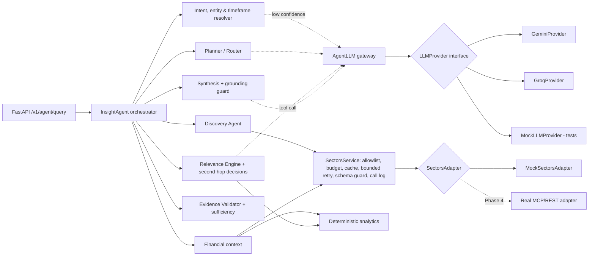

# IDX Insight Agent

An AI research and discovery assistant for Indonesian-listed companies, built on
[Sectors](https://sectors.app/) data for the SECTORS Hackathon 2026
(track: AI Agents & Assistants).

> **Core question:** *What should I pay attention to, and why does it matter?*

## Current Status

**Phases 0–5 implemented: the agent runs on real Sectors data behind a deployed
workspace** (mock data remains for tests and offline development); Phase 6 (end-to-end
validation) is in progress. See [PHASE.md](PHASE.md) — the project is currently until
Phase 6.

**Live:** https://idx-insight.vercel.app (real Sectors data, Groq `openai/gpt-oss-120b`).
Every new question spends Sectors credits; repeated questions are answered from a cache.

Overall: the product works end to end on real data and is deployed; the UI still has
gaps, and end-to-end validation, security testing and the submission materials have
not started. Sectors credits used so far: about 98 of 1,000 (49 during Phase 4, 9 on
the deployment, about 40 in the first local end-to-end run).

| Area | State | Details |
|---|---|---|
| Agent Brain (resolution, planning, discovery, relevance, second-hop) | Done | See [Agentic Workflow](#agentic-workflow) |
| Deterministic analytics, evidence validation, sufficiency assessment | Done | No LLM arithmetic; unsupported claims are rejected and reported as data gaps |
| FastAPI backend | Done | `GET /health`, `GET /v1/capabilities`, `POST /v1/agent/query` |
| Sectors data | Done | Real v2 REST adapter for the 8 endpoints the agent needs, with credit guardrails; verified live on 2026-09-27 (real-data evaluation 8/8). Fictional mock data for tests |
| Runtime LLM | Partial | Groq `openai/gpt-oss-120b` verified on every LLM path and used in production; Gemini verified for synthesis only. **Final provider not formally decided** |
| Languages | Done | Indonesian and English; the UI has an ID/EN toggle and asks the agent for the chosen language |
| Frontend (Next.js) | Done | Workspace connected to the agent: free-ticker watchlist, research history, research-type detection, ID/EN toggle, small-multiple peer chart, evidence explorer, agent trace, offline message; no illustrative data (see [frontend/README.md](frontend/README.md)) |
| Deployment (Vercel) | Done | Live since 2026-10-02 at https://idx-insight.vercel.app; see [Deployment](#deployment-vercel) |
| Deployment protections | Done | Firewall rules, shared secret, Redis credit ledger and caches, per-client and daily limits, LLM cap, security headers |
| Security testing | Not started | Prompt-injection tests against the live LLM, Python dependency audit, GitHub secret scanning and push protection, runtime log review |
| End-to-end validation (Phase 6) | In progress | First local real-data run on 2026-10-02: 5 questions, 4 as expected, 1 parser fix; see [docs/e2e-validation.md](docs/e2e-validation.md) |
| Demo and submission (Phase 7) | Not started | Videos, problem statement, social post, submission form |

## Tech Stack

| Layer | Technology | Status |
|---|---|---|
| Backend | Python 3.11+, FastAPI, Pydantic v2, httpx; served locally with uvicorn | Implemented (`backend/`) |
| Agent Brain | Our own orchestration in Python (`backend/idx_insight/agent/`); no agent framework | Implemented |
| Analytics & validation | Deterministic Python code (no LLM arithmetic) | Implemented |
| Data source | Sectors v2 REST API (`https://api.sectors.app/v2/`) through `SectorsService` → `SectorsAdapter` | Implemented (real + mock adapter) |
| Runtime LLM | Provider-agnostic `LLMProvider` interface; Groq and Gemini providers over their REST APIs | Optional; see below |
| Frontend | Next.js 16 (App Router), React 19, TypeScript, Tailwind CSS v4, Recharts, lucide-react | In progress (`frontend/`) |
| Tests | pytest + ruff (backend); `node:test`, ESLint, `tsc` (frontend) | Implemented |
| Deployment | Vercel: two projects from this repository (frontend, and the FastAPI backend as one Python function); Upstash Redis for shared state | Deployed (Hobby plan, region `iad1`) |

**Which LLM is used right now?**

- The code default is `LLM_PROVIDER=none`: no LLM, every decision uses the
  deterministic rules. The agent is fully functional this way.
- The setup the team develops and evaluates with is **Groq, model
  `openai/gpt-oss-120b`** (`LLM_PROVIDER=groq`). It is the only provider verified
  live on every LLM path (see Current Status).
- Gemini is supported but only verified live for synthesis.
- The final provider and model are **not decided** (Phase 6). Switching is a
  configuration change only.

## Running Locally: Mock Mode vs Real Data Mode

The backend and the frontend run as two processes. The browser talks only to the
Next.js server, which forwards questions to FastAPI; API keys live only in the
backend's `.env`.

### One-time setup

```bash
# from the repository root
python -m venv .venv
.venv/Scripts/pip install -e "backend[dev]"      # macOS/Linux: .venv/bin/pip
cp .env.example .env                            # backend settings (git-ignored)

cd frontend
npm ci
cp .env.example .env.local                      # IDX_INSIGHT_API_URL=http://127.0.0.1:8000
```

The backend reads `.env` in the repository root. Variables set in the shell
override it, which is the easiest way to switch modes for one run.

### The two modes at a glance

| | Mock mode | Real data mode |
|---|---|---|
| Purpose | UI work, tests, development, anything offline | Demo, videos, real-data evaluation, final checks |
| Data | Fictional fixtures that mirror Sectors response shapes (`sectors/mock_data.py`) | Live Sectors v2 API |
| Settings | `SECTORS_DATA_MODE=mock` | `SECTORS_DATA_MODE=real` + `SECTORS_API_KEY` |
| Sectors credits | **0** | Spent per question (see below) |
| LLM | Recommended `LLM_PROVIDER=none` (0 LLM quota) | `LLM_PROVIDER=groq` + `LLM_MODEL=openai/gpt-oss-120b` + `GROQ_API_KEY` |
| UI label | "Terhubung · data mock", results marked as test data | "Terhubung · data Sectors" |
| Allowed in the demo/videos | **No** (hackathon rule: real data only) | Yes |

Mock mode with an LLM enabled still spends LLM quota (Groq free tier:
about 8,000 tokens per minute observed), so use `LLM_PROVIDER=none` unless you are
testing the LLM paths.

### Mock mode (no credits)

```bash
# terminal 1: backend
cd backend
SECTORS_DATA_MODE=mock LLM_PROVIDER=none ../.venv/Scripts/python -m uvicorn idx_insight.api.app:app --reload --port 8000

# terminal 2: frontend
cd frontend
npm run dev                                     # open http://localhost:3000
```

PowerShell: set the variables first with
`$env:SECTORS_DATA_MODE="mock"; $env:LLM_PROVIDER="none"`, then run uvicorn.

Useful mock questions: "Bandingkan BBCA, BBRI, BMRI, dan BBNI dari sisi
profitabilitas dan efisiensi" or "Disclosure apa yang perlu saya pantau minggu
depan untuk bank dalam watchlist?". The fixtures include deliberate edge cases
(conflicting BMRI growth, BBNI ratios in percent, missing data) so the UI shows
data gaps and warnings.

### Real data mode (spends credits)

Before you start:

1. Agree with the team before any real-data session. Each team has **1,000 credits
   in total**, and the judging period needs a reserve (see the budget in PHASE.md).
2. Check `backend/.sectors_local/ledger.json` for credits already used.
3. Keep the caps in `.env`: `SECTORS_MAX_CREDITS_PER_DAY` (default 60) and
   `SECTORS_MAX_CREDITS_TOTAL` (default 700). A request that could exceed a cap is
   refused before it is sent.

```bash
# terminal 1: backend (keys come from .env)
cd backend
SECTORS_DATA_MODE=real LLM_PROVIDER=groq LLM_MODEL=openai/gpt-oss-120b \
  ../.venv/Scripts/python -m uvicorn idx_insight.api.app:app --reload --port 8000

# terminal 2: frontend
cd frontend
npm run dev
```

Approximate Sectors cost per question (measured call counts): one company ≈ 4
credits, a four-bank comparison ≈ 8, sector-wide disclosure discovery ≈ 16–21. The
8 real-data evaluation cases cost 28 credits in total.

Ways to save credits:

- Repeated questions are served from the local cache (`SECTORS_CACHE_MODE=readwrite`,
  the default) at no cost.
- `SECTORS_CACHE_MODE=replay` answers **only** from the cache and never calls the
  API (0 credits). Use it to rehearse a demo with questions that were already asked.
- `python -m tools.sectors_probe` shows a plan without calling anything; add
  `--run` only when you mean to spend credits.
- Unknown tickers and empty date windows still cost credits the first time.

### Checking which mode is running

```bash
curl localhost:8000/health
# {"status":"ok","data_mode":"mock","llm_provider":"none",...}

curl -X POST localhost:8000/v1/agent/query -H "content-type: application/json" \
  -d '{"query": "Bandingkan BBCA, BBRI, BMRI, dan BBNI dari sisi profitabilitas dan efisiensi"}'
```

The UI shows the same information in the top-right label. "Backend mati" means the
frontend has no backend: `IDX_INSIGHT_API_URL` is empty, or the backend is not running.
The research box is then disabled with the message "Backend mati, hubungi tim untuk
menyalakan lagi."
Restart `npm run dev` after editing `.env.local`.

## Deployment (Vercel)

Two Vercel projects from this repository; the browser only talks to the frontend.

| Project | Root Directory | URL | What runs |
|---|---|---|---|
| `idx-insight` | `frontend` | https://idx-insight.vercel.app | Next.js; its server-side proxy forwards questions to the backend with `X-Internal-Key` and the client's IP |
| `idx-insight-api` | `backend` | https://idx-insight-api.vercel.app (only `/health` answers without the shared secret) | FastAPI as one Python function (`[tool.vercel] entrypoint` in `pyproject.toml`, limits in `vercel.json`) |

Both deploy from `main`. Environment variables:

| Environment | Backend | Frontend |
|---|---|---|
| Production | `SECTORS_DATA_MODE=real`, `LLM_PROVIDER=groq`, `LLM_MODEL`, `SECTORS_API_KEY`, `GROQ_API_KEY`, credit caps, `IDX_INSIGHT_API_SECRET`, `KV_REST_API_URL`/`KV_REST_API_TOKEN` (Upstash, region `iad1`, no eviction) | `IDX_INSIGHT_API_URL`, `IDX_INSIGHT_API_SECRET` |
| Preview (other branches) | `SECTORS_DATA_MODE=mock`, `LLM_PROVIDER=none`, so branch pushes spend no credits or LLM quota | same as Production |

Credits spent by the deployment are in Redis under `idx:credits:total` (Upstash
console → Data Browser); the local ledger in `backend/.sectors_local/` counts separately.

The backend refuses to serve on Vercel without `IDX_INSIGHT_API_SECRET`, and refuses
real data without Redis, because the function's disk does not persist and the credit
caps would silently reset. With Redis:

- **Credit ledger**: the worst-case cost is reserved atomically in Redis before each
  Sectors call and corrected to the actual cost afterwards, so concurrent requests
  cannot pass a cap together. If Redis is unreachable, Sectors calls are refused.
- **Sectors cache**: raw responses expire with the same freshness rules as locally.
- **Answer cache**: a repeated question (same wording, scope, language and day) is
  answered without a new run and without spending credits or LLM quota.
- **Usage limits**: runs per client and per day, LLM calls per day (then rules-only
  answers), and a credit headroom check; limits answer HTTP 429 with
  `{"error": "rate_limited" | "daily_limit"}`.

`backend/.vercelignore` keeps `backend/.sectors_local/` (real Sectors data) and
development files out of any upload, including CLI deployments.

### Vercel Firewall rules

These live in the Vercel dashboard (Firewall → Rules), not in the repository:

| Project | Rule | Why |
|---|---|---|
| `idx-insight-api` | **Deny** when the `x-internal-key` header is missing and the path is not `/health` | Scanners and direct calls are blocked at the edge (403) before the function runs, so they cost no function usage. A wrong key still reaches the code and gets 401 |
| `idx-insight` | **Rate limit** `/api/agent/query`: 10 requests per 60 s per IP, then 429 | Caps request floods, including repeated questions served from the cache, which the per-client limit in the backend does not count. Protects the Hobby plan's usage limits, which would pause the project |

There is deliberately no per-IP rate limit on the backend: all legitimate backend
traffic comes from the frontend's functions, so an IP limit there would throttle every
visitor at once. Per-visitor limits are enforced in code with the IP the proxy forwards.
Hobby allows one rate-limit rule and three custom rules per project.

Verified on the deployment (2026-10-02): direct backend calls without the secret
(including `/docs`) are denied at the edge (403), and with a wrong key answer 401; security headers are set; neither the backend URL nor
any key appears in the HTML or client JavaScript; a new question takes 4–6 s on real
data; a repeated question is answered from Redis in about 0.6 s with no Sectors or LLM
call, also after a redeploy; the per-client limit answers 429 after five new questions
in ten minutes, and the firewall answers 429 after ten requests in a minute. The two
real-data smoke-test questions cost 9 credits.

## Project Purpose

Investors and analysts following IDX companies face a steady stream of
disclosures, corporate actions and quarterly reports. IDX Insight Agent helps
them decide what deserves attention and gives the factual financial context
behind it, with every claim traceable to Sectors data.

It is a research tool. It does **not** give buy/sell/hold recommendations and
does not trade.

## Product Concept

Our own design, inspired by two concepts in the official hackathon candidate
brief (it is not an official Sectors product or design):

- **Discovery** (inspired by the IDX Disclosure Calendar candidate): which
  disclosures and events matter for my watchlist, sector or timeframe?
- **Contextual analysis** (inspired by the Peer Lens for IDX Banks candidate):
  what does the relevant financial data show for these companies?

The agent links the two: discover what deserves attention, then investigate why
it matters using relevant contextual data.

## Agentic Workflow

The agent makes explicit, recorded decisions at each step:

0. **Detect the language** of the question (Indonesian or English); the whole
   briefing, including numbers (`23,5%` vs `23.5%`), follows it.
1. **Resolve** companies (tickers, aliases and watchlist, verified against
   Sectors with a bounded number of calls), sector, timeframe and intent.
   Ambiguous companies trigger a clarification question instead of a guess;
   vague timeframes use a documented default recorded as an assumption. The LLM
   is consulted for intent only when the rules are unsure.
2. **Plan**: choose steps for the intent (discovery, peer comparison or
   single-company context). The LLM may propose the plan; code accepts it only
   if every step is allowed, required steps are present and the order is valid.
3. **Discover** filings and corporate actions in scope, normalise them into
   events with evidence, and remove duplicates.
4. **Rank relevance** with deterministic rules (ownership-change size,
   transaction value, insider trades, dividend/AGM dates, event clusters, watchlist).
5. **Decide second-hop research** (hybrid): the two most material events are
   always researched; the LLM may add others through a
   `request_financial_context` tool call, choosing a fixed reason category
   (`dividend_capacity`, `ownership_shift`, `governance_decision`,
   `corporate_action_context`). Code enforces the guards (only listed events,
   per-request company cap, remaining tool budget, reuse). Without an LLM, a
   score threshold decides. Discovery and company-context plans always include
   the event steps unless the user explicitly asks for a plain list. Every
   decision is recorded with its reason, category and source (`llm` or `rules`).
6. **Analyse** deterministically: growth, spreads, peer medians and rankings,
   outliers, period alignment and unit normalisation.
7. **Validate evidence** for every claim, then **assess sufficiency**:
   `sufficient`, `partial` or `insufficient`, listing incomplete, conflicting,
   unavailable and malformed data separately.
8. **Synthesise** a briefing from accepted claims only: each finding states
   what happened and, for events, why it matters. An optional LLM narrative
   must cite accepted claim ids or data-gap ids in every sentence; code rejects
   the whole narrative if a sentence cites an unknown item, uses a number that
   is not in the items it cites, or contains advice or speculative language
   (for example "menandakan", "signals", "will rise").

Bounded recovery happens where the problem appears: at most one retry per
Sectors call, one widened filing window when results are empty, a prior-year
re-query for missing comparison quarters, a per-request tool-call budget, and a
cap of four LLM calls per request.

Example trace for *"Apa saja disclosure yang perlu saya pantau minggu depan untuk sektor perbankan?"* (rules-only mode):

```
Entities resolved → Intent resolved (discovery) → Timeframe resolved (2026-09-28 s/d 2026-10-04)
→ Plan selected (rules) → Discovery selected (7 companies) → Relevant events detected (7 of 9, 1 duplicate)
→ Second-hop analysis selected (rules): BBNI, BBRI, BRIS → Financial context retrieved
→ Evidence validated (sufficient) → Response synthesized
```

## Architecture



- **Dependency direction** (enforced by `tests/test_architecture.py`): the
  Agent Brain imports only the LLM interface and neutral types, never a
  provider module or vendor SDK, and reaches Sectors only through
  `SectorsService`.
- **State**: `AgentState` is explicit and serializable; it holds intent,
  entities, timeframe, plan, events, second-hop decisions, evidence, metric
  values, claims, the validation report and assessment, data gaps, recovery
  actions, Sectors tool calls, LLM call records and the trace.
- **Stateless requests**: each query gets its own `SectorsService`, LLM gateway
  and state, which keeps the backend compatible with serverless deployment on Vercel.

```
backend/
  idx_insight/
    agent/       orchestrator, resolvers, planner, discovery, relevance/second-hop,
                 financial context, analysis, validator, synthesis, recovery,
                 llm_gateway, prompts, state
    analytics/   numbers, periods, peers, events/relevance rules, metric catalog
    sectors/     adapter interface, schemas, mock adapter + fixtures, SectorsService
    llm/         provider interface, neutral types, errors, structured output,
                 Gemini and Groq providers, shared HTTP transport, mock provider
    api/         FastAPI app, request/response schemas, service layer
    config.py    environment-driven settings
  tests/
```

## Data Source

Sectors v2 REST API (https://docs.sectors.app/), the only market-data source
(confirmed by the Sectors team). The adapter maps one method to each endpoint the
agent uses; costs follow the official billing rules:

| Adapter method | Endpoint | Credits |
|---|---|---|
| `get_filings` | `GET /v2/filings/` | 1 per page |
| `get_corporate_actions_calendar` | `GET /v2/corporate-actions/` (whole market) | 1 per action type |
| `get_corporate_actions` | `GET /v2/company/corporate-actions/{symbol}/` | 1 |
| `get_quarterly_financials` | `GET /v2/financials/quarterly/{symbol}/` | 1 per quarter returned |
| `get_quarterly_financial_dates` | `GET /v2/company/get_quarterly_financial_dates/{symbol}/` | 1 |
| `get_company_report` | `GET /v2/company/report/{symbol}/` | 1 per section |
| `list_subsectors` | `GET /v2/subsectors/` | 1 |
| `list_companies`, `get_company_metrics` | `GET /v2/companies/` (screener) | 1 |

A 404 costs one credit and an empty result is billed like any success; 400,
401/403, 429 and 5xx are free. The agent therefore chooses the cheapest route:
one calendar call for a whole sector instead of one call per company, one
quarter at a time instead of five, only the report sections a metric needs, and
one screener call for NPL across all compared banks.

Metrics are computed only from Sectors fields: company-report ratios (ROA, ROE,
NIM, cost-to-income, CASA, LDR, CAR), growth and ratios from quarterly
financials, and the NPL ratio from screener fields (`non_performing_loan` ÷
`gross_loan`). Other requested metrics (e.g. BOPO) are reported as data gaps,
not estimated. Responses that do not match the documented shape are reported as
malformed rather than crashing the agent.

### Data handling

Sectors data is proprietary. The Sectors API security guide names data scraping
and *unauthorized redistribution* as misuse, and this repository will be public
for judging. Until the team has confirmed the Sectors Terms of Service
(https://sectors.app/terms-of-service), follow these rules:

- **Never commit real Sectors responses.** Recordings of real API responses and
  the local development cache live only in `backend/.sectors_local/`, which is
  git-ignored. Automated tests use the fictional mock data in
  `backend/idx_insight/sectors/mock_data.py`, so they spend no credits and contain
  no Sectors data.
- **Record once, reuse locally.** When a real response is needed for development,
  call the endpoint once, save it under `backend/.sectors_local/`, and reuse it
  instead of calling the API again.
- **Show data, don't bulk-export it.** The product displays Sectors data in
  answers to user questions; it must not offer downloads or dumps of raw datasets.
- **Keys stay server-side.** `SECTORS_API_KEY` lives in `.env` locally and in
  Vercel environment variables when deployed; never in frontend code, commits or logs.
- **Credits are limited.** Each team receives 1,000 hackathon credits for this project
  only. Check the credit budget in PHASE.md before running bulk or live evaluations.

## Mock vs Real Sectors Integration

`SECTORS_DATA_MODE=real` uses `RestSectorsAdapter` over the v2 REST API; `mock`
uses `MockSectorsAdapter`, whose fictional fixtures mirror the verified response
*shapes* and are used by automated tests and offline development only — never in
the demo, videos or deployment. Real mode without a key returns HTTP 503 rather
than faking data.

Every real request passes through credit guardrails (`sectors/credits.py`,
`sectors/http_client.py`):

- worst-case cost checked against a daily and a total cap **before** sending;
  actual cost recorded in a ledger file (`backend/.sectors_local/ledger.json`)
- local cache of raw responses (`backend/.sectors_local/cache/`), which doubles
  as the recording of real data; `SECTORS_CACHE_MODE=replay` never calls the API
- bounded exponential backoff on HTTP 429; dates clamped to Sectors' UTC day
- invalid symbols and screener fields rejected before any request (a 404 costs a credit)

Check a plan without spending anything with `python -m tools.sectors_probe`
(add `--run` to probe the endpoints once).

The mock deliberately includes: a late quarterly report (BBTN), an incomplete
report (BRIS Q2 2026), ratios reported in percent instead of fractions (BBNI),
missing metrics (CASA for BRIS/BTPS), stale-only data (BTPS), contradictory
growth figures (BMRI), a duplicated filing (BMRI), an empty corporate-actions
result (BTPS), an ambiguous alias ("bank syariah"), and injectable failures per
tool and symbol (a number of transient failures, `"always"`, or `"malformed"`).

Verified against live responses (2026-09-27): the `year` key of
`historical_financial_ratio` (a string such as `"2025"`), the screener and
subsector list shapes, and that the screener matches symbols only with the
`.JK` suffix. Still unverified: the populated shape of `upcoming_dividend`
(not used) and sub-sector names with several words in screener filters. No
documented endpoint provides upcoming financial-report dates; the agent states
this as an informational gap.

## Runtime LLM

The product's runtime LLM is provider-agnostic and optional.

| `LLM_PROVIDER` | Behaviour |
|---|---|
| `none` (default) | No LLM calls; every decision uses the deterministic policies |
| `gemini` | Google Gemini API, REST `models/{model}:generateContent` |
| `groq` | Groq API, REST chat completions |

- **Candidates under evaluation**: a Gemini Flash model (e.g. `gemini-3.8-flash`)
  and GPT-OSS 120B on Groq (`openai/gpt-oss-120b`). Neither is a final choice,
  and free-tier availability depends on each provider's current quotas and policies.
- **Switching providers** changes configuration only; the Agent Brain is not modified.
- **Structured output**: schemas are generated from Pydantic models in a
  strict-mode-compatible form (Gemini `responseFormat`, Groq `json_schema` with
  `strict: true`) and every reply is validated in our code. Malformed output is
  rejected and the decision falls back to the rules.
- **Tool calling**: provider tool-call formats are normalised to `LLMToolCall`;
  arguments are schema-validated before the agent acts on them.
- **Errors** are normalised (`configuration`, `authentication`, `rate_limit`,
  `timeout`, `unavailable`, `invalid_request`, `malformed_response`,
  `invalid_structured_output`). No request is retried against a different
  provider; a misconfigured provider makes the API return 503.
- **Observability**: each call is recorded with purpose, provider, model,
  status, latency and token usage (no prompts, replies or keys), exposed as
  `llm_calls` in the API response and logged under `idx_insight.llm`.
- **Mock mode**: `MockLLMProvider` scripts structured replies, tool calls, text
  and failures per purpose, so tests need no API key, quota or network.
- **Observed free-tier limits during testing (2026-09-26/27, may change)**: Groq
  returned 429 at 8,000 tokens per minute for `openai/gpt-oss-120b`; Gemini
  returned 503 (high demand) and then 429 after a handful of calls. Rate-limited
  calls fall back to the deterministic rules.

## Configuration

All settings come from environment variables (see `.env.example`). For local
development the API also reads a `.env` file in the repository root (git-ignored);
variables already set in the real environment always take precedence.

| Variable | Purpose |
|---|---|
| `SECTORS_DATA_MODE` | `mock` (fixtures, no credits) or `real` (Sectors API) |
| `SECTORS_API_KEY` | Sectors v2 API key, sent as `Authorization: <key>` (server-side only) |
| `SECTORS_CACHE_MODE` | `readwrite` (default), `replay` (0 credits) or `off` |
| `SECTORS_MAX_CREDITS_PER_DAY` / `SECTORS_MAX_CREDITS_TOTAL` | hard credit caps (default 60 / 700) |
| `LLM_PROVIDER` | `none`, `gemini` or `groq` |
| `LLM_MODEL` | model id; required for `gemini`/`groq`, no built-in default |
| `GEMINI_API_KEY` / `GROQ_API_KEY` | key for the selected provider |
| `LLM_TIMEOUT_SECONDS` | per-call timeout (default 20) |
| `LLM_TEMPERATURE` | optional; provider default when empty |
| `LLM_MAX_OUTPUT_TOKENS` | output cap (default 4096) |
| `AGENT_MAX_TOOL_CALLS` / `AGENT_MAX_SECOND_HOP` / `AGENT_MAX_REQUERIES` | agent bounds |
| `IDX_INSIGHT_API_SECRET` | shared with the Next.js server; required in `X-Internal-Key` on every route except `/health` when set; required on Vercel |
| `UPSTASH_REDIS_REST_URL` / `UPSTASH_REDIS_REST_TOKEN` | Redis for the credit ledger, caches and usage counters (also read as `KV_REST_API_URL` / `KV_REST_API_TOKEN`); required for real data on Vercel |
| `STORAGE_PREFIX` | key prefix in Redis (default `idx:`) |
| `RATE_LIMIT_PER_IP` / `RATE_LIMIT_WINDOW_SECONDS` | agent runs per client per window (default 5 per 600 s) |
| `MAX_QUERIES_PER_DAY` | agent runs per day across all clients (default 150) |
| `LLM_MAX_CALLS_PER_DAY` | LLM calls per day; beyond it answers use the rules (default 300) |
| `QUERY_CREDIT_HEADROOM` | refuse a new run when fewer Sectors credits remain under a cap (default 10) |
| `ANSWER_CACHE_TTL_SECONDS` | how long a repeated question is answered from the cache (default 6 h; 0 disables) |

## Implemented Features

- Intent resolution (discovery / peer comparison / company context / clarify),
  advice-request detection, metric bundles, unsupported-metric detection
- Entity resolution with bounded Sectors verification, ambiguity handling and sector scope
- Timeframe resolution (ID/EN phrasing, ISO ranges, quarters, years, defaults)
- Guarded LLM planner and LLM-selected second-hop research, both with rule fallbacks
- Discovery of filings and corporate actions, normalisation, deduplication
- Deterministic relevance rules
- Peer comparison with period alignment, unit normalisation, spreads, medians,
  rankings and robust outlier detection
- Evidence validation (missing source, wrong company, wrong period, unsupported
  metric, contradictory values, insufficient evidence, stale data, calculation
  without inputs) and an evidence sufficiency assessment
- Bounded recovery (see Agentic Workflow)
- Grounded synthesis with a non-advice boundary note
- Real Sectors integration with credit guardrails, local cache/replay and
  credit-aware routing; NPL ratio from the Sectors screener
- FastAPI: `GET /health`, `GET /v1/capabilities`, `POST /v1/agent/query`

## Testing

```bash
python -m venv .venv
.venv/Scripts/pip install -e "backend[dev]"     # macOS/Linux: .venv/bin/pip
cd backend
../.venv/Scripts/python -m pytest -q
../.venv/Scripts/ruff check idx_insight tests evals
```

293 deterministic tests cover agent decisions (resolution, planning, discovery,
relevance, second-hop with and without an LLM, recovery), analytics, evidence
validation and sufficiency, the Sectors service and mock adapter, the LLM layer
(Gemini/Groq request and response normalisation through a fake HTTP transport,
structured output, tool calls, error normalisation, configuration), dependency
direction, bilingual output, the evaluation cases, the API contract and the deployment
protections (shared store, Redis REST format, shared credit ledger, internal key, usage
limits, answer cache). No test
needs an API key or network access; tests never read a local `.env`.

### Evaluation

`backend/evals/cases.json` holds 17 questions (Indonesian and English) with the
expected decisions on mock data: intent, language, status, second-hop coverage,
detected conflicts and data gaps. `backend/evals/cases_real.json` holds 8
structural cases for real data (no fixed values, since real data changes).
Guardrails apply to every case: no advice or speculative language, evidence
behind every accepted claim.

```bash
cd backend
../.venv/Scripts/python -m evals.run_eval                                  # mock, rules-only
../.venv/Scripts/python -m evals.run_eval --live --pause 25                # mock + LLM from .env
SECTORS_DATA_MODE=real ../.venv/Scripts/python -m evals.run_eval --cases real --live --pause 25
```

The harness prints the Sectors credits each run used. Latest runs (2026-09-27,
Groq): mock cases 16/16 with 12 of 13 narratives accepted; real-data cases 8/8
for 28 credits. The real-data run found a bug the mock could not (sub-sector
display names such as "Banks" vs the slug "banks"), since fixed.

To run the API and the UI, see
[Running Locally: Mock Mode vs Real Data Mode](#running-locally-mock-mode-vs-real-data-mode).

## Known Limitations

- Locally the credit ledger and cache are files under `backend/.sectors_local/`; a
  deployment keeps them in Redis, so the two ledgers count separately. Compare both
  with the Sectors dashboard before setting the deployed caps.
- Sectors bills 404s and empty results, so repeated questions about unknown
  tickers or empty windows still cost credits the first time.
- Only Groq has been exercised on every LLM path against the live API; Gemini's
  structured output and tool calling are covered by tests with recorded payloads
  but not yet verified live. Groq strict structured output only works on models
  Groq lists as supporting it.
- Free-tier rate limits make back-to-back requests fall back to the rules; the
  final provider, model and tier are not decided.
- Entity aliases cover a small set of companies; other companies are recognised
  by their ticker.
- Relevance weights and thresholds are initial heuristics and need tuning on real data.
- The analysis is built for banks: the metric catalogue (NIM, CASA, LDR, CAR, NPL,
  cost-to-income) and every evaluation case are about banks. Discovery of disclosures
  works by ticker and sub-sector in general, but questions about non-bank companies
  have not been tested.
- Only part of the Sectors integration has been exercised through the deployment
  (company report, quarterly financials, filings, per-company corporate actions). The
  market-wide calendar, screener (NPL), sub-sector list and report dates were verified
  live on 2026-09-27 from a local run, not yet through the deployment. Values have not
  been cross-checked against the Sectors app.
- Only Indonesian and English are supported.
- The watchlist accepts any IDX ticker, but at most 3 tickers the agent does not know
  yet are verified per question; the rest are reported as unverified.
- Research history is kept in the visitor's browser only.
- The API is meant to be called only by the Next.js server (shared secret); it has no
  end-user accounts. Per-client limits use the client IP forwarded by that server.

## Remaining Work

Phases are defined in [PHASE.md](PHASE.md); the project is currently until Phase 6.

**Product UI (Phase 5)**
- Done: free-ticker watchlist, research history, research-type detection, ID/EN toggle,
  progress feedback, firewall 429 message, small-multiple chart, offline state, mobile layout
- Smaller components in `frontend/app/page.tsx`
- A trend chart needs multi-period series in the API response

**End-to-end validation (Phase 6, in progress)**
- Done: first local real-data run, 5 questions (see [docs/e2e-validation.md](docs/e2e-validation.md))
- Re-run the 8 real-data evaluation cases (about 28–35 credits)
- Exercise every Sectors endpoint through the deployed product: sector-wide discovery
  (market-wide calendar), NPL comparison (screener), ambiguous names, unknown tickers
- Cross-check a sample of values against the Sectors app
- Questions about non-bank companies and other sectors
- Failure cases: Groq rate limit, credit cap reached, Redis unavailable, timeouts
- Latency and credits per question type
- Final runtime LLM provider and model

**Security checks (Phase 6, not started)**
- Prompt injection and advice requests against the live LLM (system-prompt extraction,
  instructions to ignore rules, fabricated claims, HTML or script in questions)
- Independent re-test of the deployment protections (missing or wrong key, spoofed
  client IP, per-client and firewall limits, keys or backend URL in the browser)
- `pip-audit` for the backend dependencies (`npm audit` for the frontend: 0 vulnerabilities)
- GitHub secret scanning and push protection on the public repository
- Review of the Vercel runtime logs for secrets

**Demo and submission (Phase 7, not started)**
- One-sentence problem statement; one-minute teaser; judging video of up to three
  minutes recorded on the live product with real data and the LLM enabled
- A short overview for judges at the top of this README (live link, videos, screenshots)
- Social media post with the Sectors thumbnail template; submission form
- Credit caps for the judging period (9–16 Oct) with at least 200 credits in reserve
