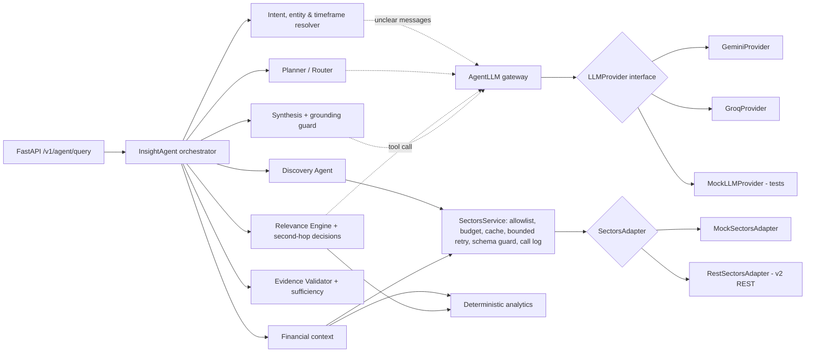

# IDX Insight Agent

An AI research and discovery assistant for Indonesian-listed companies, built on
[Sectors](https://sectors.app/) data for the SECTORS Hackathon 2026
(track: AI Agents & Assistants).

> **Core question:** *What should I pay attention to, and why does it matter?*

## Current Status

**Phases 0–5 implemented; Phase 6 (end-to-end validation) is complete apart from the
team actions listed under [Remaining Work](#remaining-work); Phase 7 (submission) is next.** The
deployed workspace uses real Sectors data; mock data remains for tests and local
development. Vercel Preview has no backend connection. See [PHASE.md](PHASE.md).

**Live deployed build:** https://idx-insight.vercel.app (real Sectors data, Groq
`openai/gpt-oss-120b`). A new research question spends Sectors credits. Repeated
cacheable questions can be answered from a fresh cache. Ordinary non-research messages
(e.g. "who are you?") make no Sectors call, but entity verification can call Sectors
first for an unknown ticker-like word; see [Known Limitations](#known-limitations)
and [Data Freshness and Caching](#data-freshness-and-caching).

Overall: the product works end to end on real data and is deployed; validation and
security testing are done; submission materials have not started. Sectors credits:
730 of 1,000 left on the Sectors dashboard on 2026-10-07 (270 spent on development,
validation and the deployment so far), well above the 200 reserved for judging.

**Latest validation (2026-10-07):** the 5 October fixes pass in production; screener
NPL, unknown ticker, company name and non-bank sector discovery checked live; a real
Groq 429 fell back to deterministic synthesis; desktop browser checks, deployment
protections, prompt injection, `pip-audit`, `npm audit` and a Git history secret scan
done. One UI defect found and fixed (evidence for computed values). See the
[validation report](docs/e2e-validation-2026-10-07.md) and the
[5 October report](docs/e2e-validation-2026-10-05.md).

| Area | State | Details |
|---|---|---|
| Agent Brain (resolution, planning, discovery, relevance, second-hop) | Done | See [Agentic Workflow](#agentic-workflow) |
| Deterministic analytics, evidence validation, sufficiency assessment | Done | No LLM arithmetic; unsupported claims are rejected and reported as data gaps |
| FastAPI backend | Done | `GET /health`, `GET /v1/capabilities`, `POST /v1/agent/query` |
| Sectors data | Done | Real v2 REST adapter for the 8 endpoints the agent needs, with credit guardrails; verified live on 2026-09-27 (real-data evaluation 8/8). Fictional mock data for tests |
| Runtime LLM | In use | Groq `openai/gpt-oss-120b` in production, verified on every LLM path, including a real 429 that fell back to the rules; deterministic rules take over without it. Gemini is supported but verified for synthesis only. Groq stays for the submission unless the team decides otherwise |
| Languages | Done | Indonesian and English, detected from each question; the answer and the interface follow it (the ID/EN toggle still sets the interface). Other scripts (e.g. Japanese) get a short bilingual "Indonesian and English only" reply |
| Frontend (Next.js) | Implemented; refinement ongoing | Bilingual landing page with a sticky section menu and banking glossary; watchlist; full per-browser history; peer small multiples and evidence-backed trend line; replies for non-research questions; a context-aware follow-up per result; reorderable widgets; evidence explorer and agent trace (see [frontend/README.md](frontend/README.md)) |
| Deployment (Vercel) | Done | Live since 2026-10-02 at https://idx-insight.vercel.app; see [Deployment](#deployment-vercel) |
| Deployment protections | Done | Firewall rules, shared secret, Redis credit ledger and caches, per-client and daily limits, LLM cap, security headers |
| Security testing | Done | Deployment protections re-tested live; prompt injection (system-prompt extraction, fake role blocks, injected buy text) fails; Redis outage fails closed; `pip-audit` clean; `npm audit` one build-time-only finding; Git history scan clean. GitHub secret scanning and push protection enabled; Vercel runtime logs reviewed, no secrets |
| End-to-end validation (Phase 6) | Done (mobile check open) | Real-data runs, scope evaluation 44/44, 5 Oct cross-checks and 7 Oct post-deployment retests, endpoint coverage and desktop browser checks. See [latest report](docs/e2e-validation-2026-10-07.md) |
| Demo and submission (Phase 7) | Not started | Videos, problem statement, social post, submission form |

## Tech Stack

| Layer | Technology | Status |
|---|---|---|
| Backend | Python 3.11+, FastAPI, Pydantic v2, httpx; served locally with uvicorn | Implemented (`backend/`) |
| Agent Brain | Our own orchestration in Python (`backend/idx_insight/agent/`); no agent framework | Implemented |
| Analytics & validation | Deterministic Python code (no LLM arithmetic) | Implemented |
| Data source | Sectors v2 REST API (`https://api.sectors.app/v2/`) through `SectorsService` → `SectorsAdapter` | Implemented (real + mock adapter) |
| Runtime LLM | Provider-agnostic `LLMProvider` interface; Groq and Gemini providers over their REST APIs | Optional; see below |
| Frontend | Next.js 16 (App Router), React 19, TypeScript, Tailwind CSS v4, Recharts, GSAP, Motion, lucide-react | Implemented; refinement ongoing (`frontend/`) |
| Tests | pytest + ruff (backend); `node:test`, ESLint, `tsc` (frontend) | Implemented |
| Deployment | Vercel: two projects from this repository (frontend, and the FastAPI backend as one Python function); Upstash Redis for shared state | Deployed (Hobby plan, region `iad1`) |

**Which LLM is used where?**

| Where | LLM | Data |
|---|---|---|
| Production (https://idx-insight.vercel.app) | **Groq, `openai/gpt-oss-120b`** | Real Sectors data |
| Local development, as the team runs it | Groq, from `.env` (`LLM_PROVIDER=groq`) | Mock by default; real with `SECTORS_DATA_MODE=real` |
| Vercel Preview (branch pushes) | none | none: the frontend has no backend there |
| Automated tests and the rules-only evaluation | none (tests use `MockLLMProvider`) | Mock |

The LLM is optional by design. If `LLM_PROVIDER` is not set, the code falls back to
`none` and every decision is taken by the deterministic rules; the same rules take
over whenever Groq is unavailable or rate-limited, so the product keeps working.
Groq is the only provider verified live on every LLM path. Gemini is supported but
verified live for synthesis only. Changing provider or model is a configuration
change.

## Running Locally: Mock Mode vs Real Data Mode

The backend and the frontend run as two processes. The browser talks only to the
Next.js server, which forwards questions to FastAPI; API keys live only in the
backend's `.env`.

### One-time setup

```bash
# from the repository root (macOS/Linux)
python3 -m venv .venv
.venv/bin/python -m pip install -e "backend[dev]"
cp .env.example .env                            # backend settings (git-ignored)

cd frontend
npm ci
cp .env.example .env.local                      # IDX_INSIGHT_API_URL=http://127.0.0.1:8000
```

The backend reads `.env` in the repository root. Variables set in the shell
override it, which is the easiest way to switch modes for one run.
If `IDX_INSIGHT_API_SECRET` is set locally, use the same value in the root `.env`
and `frontend/.env.local`; both may be empty for localhost development, but the
deployed backend requires a secret.

### The two modes at a glance

| | Mock mode | Real data mode |
|---|---|---|
| Purpose | UI work, tests, development, anything offline | Demo, videos, real-data evaluation, final checks |
| Data | Fictional fixtures that mirror Sectors response shapes (`sectors/mock_data.py`) | Live Sectors v2 API |
| Settings | `SECTORS_DATA_MODE=mock` | `SECTORS_DATA_MODE=real` + `SECTORS_API_KEY` |
| Sectors credits | **0** | Spent per question (see below) |
| LLM | Either: `LLM_PROVIDER=none` (rules only, no LLM quota) or `groq` (the team's usual setup for trying the UI and the routing) | `LLM_PROVIDER=groq` + `LLM_MODEL=openai/gpt-oss-120b` + `GROQ_API_KEY` |
| UI label | "Terhubung · data mock", results marked as test data | "Terhubung · data Sectors" |
| Allowed in the demo/videos | **No** (hackathon rule: real data only) | Yes |

Mock mode with an LLM enabled spends no Sectors credits but does spend Groq quota
(about 8,000 tokens per minute observed on the free tier), shared with production
because the key is the same. Use `LLM_PROVIDER=none` when the LLM paths do not matter.

### Mock mode (no credits)

```bash
# terminal 1: backend
cd backend
SECTORS_DATA_MODE=mock LLM_PROVIDER=none ../.venv/bin/python -m uvicorn idx_insight.api.app:app --reload --port 8000
# or, with the LLM (mock data, Groq quota only):
SECTORS_DATA_MODE=mock LLM_PROVIDER=groq ../.venv/bin/python -m uvicorn idx_insight.api.app:app --reload --port 8000

# terminal 2: frontend
cd frontend
npm run dev                                     # open http://localhost:3000
```

PowerShell: use `.venv\Scripts\python` and set the variables first with
`$env:SECTORS_DATA_MODE="mock"; $env:LLM_PROVIDER="none"`.

Useful mock questions: "Bandingkan BBCA, BBRI, BMRI, dan BBNI dari sisi
profitabilitas dan efisiensi" or "Disclosure apa yang perlu saya pantau minggu
depan untuk bank dalam watchlist?". The fixtures include deliberate edge cases
(conflicting BMRI growth, BBNI ratios in percent, missing data) so the UI shows
data gaps and warnings.

For a local production preview, run `npm run build` and then
`npm run start -- --hostname 127.0.0.1 --port 3000` from `frontend/`. `npm run start`
serves the last build, so build again after changing the source. Builds do not use the
Turbopack build cache (see [Deployment](#deployment-vercel)).

### Real data mode (spends credits)

Before you start:

1. Agree with the team before any real-data session. Each team has **1,000 credits
   in total**, and the judging period needs a reserve (see the budget in PHASE.md).
2. Check `backend/.sectors_local/ledger.json` for credits already used.
3. Keep the caps in `.env`: `SECTORS_MAX_CREDITS_PER_DAY` (default 60) and
   `SECTORS_MAX_CREDITS_TOTAL` (default 700). A request that could exceed a cap is
   refused before it is sent.

```bash
# terminal 1: backend (keys come from .env)
cd backend
SECTORS_DATA_MODE=real LLM_PROVIDER=groq LLM_MODEL=openai/gpt-oss-120b \
  ../.venv/bin/python -m uvicorn idx_insight.api.app:app --reload --port 8000

# terminal 2: frontend
cd frontend
npm run dev
```

Approximate Sectors cost per question (measured call counts): one company ≈ 4
credits, a four-bank comparison ≈ 8, sector-wide disclosure discovery ≈ 16–21. The
8 real-data evaluation cases cost 28 credits in total.

Ways to save credits:

- A Sectors call repeated with the same parameters is served from the local response
  cache while it is fresh (`SECTORS_CACHE_MODE=readwrite`, the default) at no cost; see
  [Data Freshness and Caching](#data-freshness-and-caching). The answer cache also works
  locally in process memory; restarting the backend clears that local answer cache.
- `SECTORS_CACHE_MODE=replay` answers **only** from the cache and never calls the
  API (0 credits). Use it to rehearse a demo with questions that were already asked.
- `python -m tools.sectors_probe` shows a plan without calling anything; add
  `--run` only when you mean to spend credits.
- Unknown tickers and empty date windows still cost credits the first time.

### Checking which mode is running

```bash
curl localhost:8000/health
# {"status":"ok","data_mode":"mock","llm_provider":"none",...}

curl -X POST localhost:8000/v1/agent/query -H "content-type: application/json" \
  -d '{"query": "Bandingkan BBCA, BBRI, BMRI, dan BBNI dari sisi profitabilitas dan efisiensi"}'
```

The UI shows the same information in the top-right label. "Backend mati" means the
frontend has no backend: `IDX_INSIGHT_API_URL` is empty, or the backend is not running.
The research box is then disabled with the message "Backend mati, hubungi tim untuk
menyalakan lagi."
Restart `npm run dev` after editing `.env.local`.

## Deployment (Vercel)

Two Vercel projects from this repository; the browser only talks to the frontend.

| Project | Root Directory | URL | What runs |
|---|---|---|---|
| `idx-insight` | `frontend` | https://idx-insight.vercel.app | Next.js; its server-side proxy forwards questions to the backend with `X-Internal-Key` and the client's IP |
| `idx-insight-api` | `backend` | https://idx-insight-api.vercel.app (only `/health` answers without the shared secret) | FastAPI as one Python function (`[tool.vercel] entrypoint` in `pyproject.toml`, limits in `vercel.json`) |

Both deploy from `main`. Environment variables:

| Environment | Backend | Frontend |
|---|---|---|
| Production | `SECTORS_DATA_MODE=real`, `LLM_PROVIDER=groq`, `LLM_MODEL`, `SECTORS_API_KEY`, `GROQ_API_KEY`, credit caps, `IDX_INSIGHT_API_SECRET`, `KV_REST_API_URL`/`KV_REST_API_TOKEN` (Upstash, region `iad1`, no eviction) | `IDX_INSIGHT_API_URL`, `IDX_INSIGHT_API_SECRET` |
| Preview (other branches) | `SECTORS_DATA_MODE=mock`, `LLM_PROVIDER=none`, so branch pushes spend no credits or LLM quota | none: since 2026-10-05 `IDX_INSIGHT_API_URL` and `IDX_INSIGHT_API_SECRET` are Production-only, so a Preview shows the offline state instead of calling the production backend. Previews are also behind Vercel Authentication. Try UI changes locally (mock data + LLM) |

Credits spent by the deployment are in Redis under `idx:credits:total` (Upstash
console → Data Browser); the local ledger in `backend/.sectors_local/` counts separately.

The backend refuses to serve on Vercel without `IDX_INSIGHT_API_SECRET`, and refuses
real data without Redis, because the function's disk does not persist and the credit
caps would silently reset. With Redis:

- **Credit ledger**: the worst-case cost is reserved atomically in Redis before each
  Sectors call and corrected to the actual cost afterwards, so concurrent requests
  cannot pass a cap together. If Redis is unreachable, Sectors calls are refused.
- **Sectors cache**: raw responses expire with the same freshness rules as locally
  (see [Data Freshness and Caching](#data-freshness-and-caching)).
- **Answer cache**: a repeated question (same wording, scope, language and day) is
  answered without a new run and without spending credits or LLM quota.
- **Usage limits**: runs per client and per day, LLM calls per day (then rules-only
  answers), and a credit headroom check; limits answer HTTP 429 with
  `{"error": "rate_limited" | "daily_limit"}`.

`backend/.vercelignore` keeps `backend/.sectors_local/` (real Sectors data) and
development files out of any upload, including CLI deployments.

The frontend builds without the Turbopack build cache
(`experimental.turbopackFileSystemCacheForBuild: false` in `next.config.ts`). Next.js
16.3 enables that cache by default and Vercel restores it between deployments; on
2026-10-05 it shipped an old stylesheet and the landing page rendered unstyled. The
prerender test now checks that the linked stylesheet contains the current rules.

### Vercel Firewall rules

These live in the Vercel dashboard (Firewall → Rules), not in the repository:

| Project | Rule | Why |
|---|---|---|
| `idx-insight-api` | **Deny** when the `x-internal-key` header is missing and the path is not `/health` | Scanners and direct calls are blocked at the edge (403) before the function runs, so they cost no function usage. A wrong key still reaches the code and gets 401 |
| `idx-insight` | **Rate limit** `/api/agent/query`: 10 requests per 60 s per IP, then 429 | Caps request floods, including repeated questions served from the cache, which the per-client limit in the backend does not count. Protects the Hobby plan's usage limits, which would pause the project |

There is deliberately no per-IP rate limit on the backend: all legitimate backend
traffic comes from the frontend's functions, so an IP limit there would throttle every
visitor at once. Per-visitor limits are enforced in code with the IP the proxy forwards.
Hobby allows one rate-limit rule and three custom rules per project.

Verified on the deployment (2026-10-02): direct backend calls without the secret
(including `/docs`) are denied at the edge (403), and with a wrong key answer 401; security headers are set; neither the backend URL nor
any key appears in the HTML or client JavaScript; a new question takes 4–6 s on real
data; a repeated question is answered from Redis in about 0.6 s with no Sectors or LLM
call, also after a redeploy; the per-client limit answers 429 after five new questions
in ten minutes, and the firewall answers 429 after ten requests in a minute. The two
real-data smoke-test questions cost 9 credits.

## Project Purpose

Investors and analysts following IDX companies face a steady stream of
disclosures, corporate actions and quarterly reports. IDX Insight Agent helps
them decide what deserves attention and gives the factual financial context
behind it, with every claim traceable to Sectors data.

It is a research tool. It does **not** give buy/sell/hold recommendations and
does not trade.

## Product Concept

Our own design, inspired by two concepts in the official hackathon candidate
brief (it is not an official Sectors product or design):

- **Discovery** (inspired by the IDX Disclosure Calendar candidate): which
  disclosures and events matter for my watchlist, sector or timeframe?
- **Contextual analysis** (inspired by the Peer Lens for IDX Banks candidate):
  what does the relevant financial data show for these companies?

The agent links the two: discover what deserves attention, then investigate why
it matters using relevant contextual data.

## Agentic Workflow

The agent makes explicit, recorded decisions at each step:

0. **Detect the language** of the question (Indonesian or English); the whole
   briefing, including numbers (`23,5%` vs `23.5%`), follows it. A message mostly in
   another script (e.g. Japanese) gets a bilingual "Indonesian and English only" reply
   with no LLM or Sectors call.
1. **Resolve** companies (tickers, aliases and watchlist, verified against
   Sectors with a bounded number of calls), sector, timeframe and intent.
   Ambiguous companies trigger a clarification question instead of a guess;
   vague timeframes use a documented default recorded as an assumption. Clear
   research requests (companies or a sector plus research words) are decided by
   rules; the LLM decides every other message from a closed list: the three
   research intents, `about` (who the agent is, what it can do), `advice` (a
   judgement or pick without named companies), `out_of_scope` and `clarify`. The
   non-research intents are answered from fixed templates without research calls
   (earlier entity verification may already have called Sectors),
   with one research question the LLM suggests (kept only if it is short, a
   runnable research request and free of advice wording). Without an LLM the rules
   decide, using the same categories.
2. **Plan**: choose steps for the intent (discovery, peer comparison or
   single-company context). The LLM may propose the plan; code accepts it only
   if every step is allowed, required steps are present and the order is valid.
3. **Discover** filings and corporate actions in scope, normalise them into
   events with evidence, and remove duplicates.
4. **Rank relevance** with deterministic rules (ownership-change size,
   transaction value, insider trades, dividend/AGM dates, event clusters, watchlist).
5. **Decide second-hop research** (hybrid): the two most material events with a
   relevance score of at least 50 are always researched; the LLM may add others through a
   `request_financial_context` tool call, choosing a fixed reason category
   (`dividend_capacity`, `ownership_shift`, `governance_decision`,
   `corporate_action_context`). Code enforces the guards (only listed events,
   per-request company cap, remaining tool budget, reuse). Without an LLM, a
   score threshold decides. Discovery and company-context plans always include
   the event steps unless the user explicitly asks for a plain list. Every
   decision is recorded with its reason, category and source (`llm` or `rules`).
6. **Analyse** deterministically: growth, spreads, peer medians and rankings,
   outliers, period alignment and unit normalisation.
7. **Validate evidence** for every claim, then **assess sufficiency**:
   `sufficient`, `partial` or `insufficient`, listing incomplete, conflicting,
   unavailable and malformed data separately.
8. **Synthesise** a briefing from accepted claims only: each finding states
   what happened and, for events, why it matters. An optional LLM narrative
   selects and orders accepted claim or data-gap ids; the public text is rendered
   from those validated items, never from model-written prose. Code rejects the
   whole narrative if a sentence cites an unknown item, uses a number that
   is not in the items it cites, or contains advice or speculative language.

Bounded recovery happens where the problem appears: at most one adapter retry per
Sectors service call, plus up to two HTTP retries for a 429 inside each adapter
invocation (1 s and 2 s backoff), one widened filing window when results are empty, a prior-year
re-query for missing comparison quarters, a per-request tool-call budget, and a
cap of four LLM calls per request.

Example trace for *"Apa saja disclosure yang perlu saya pantau minggu depan untuk sektor perbankan?"* (rules only, mock data):

```
Entities resolved → Intent resolved (discovery) → Timeframe resolved (2026-09-28 s/d 2026-10-04)
→ Plan selected (rules) → Discovery selected (7 companies) → Relevant events detected (7 of 9, 1 duplicate)
→ Second-hop analysis selected (rules): BBNI, BBRI, BRIS → Financial context retrieved
→ Evidence validated (sufficient) → Response synthesized
```

## Architecture



- **Dependency direction** (enforced by `tests/test_architecture.py`): the
  Agent Brain imports only the LLM interface and neutral types, never a
  provider module or vendor SDK, and reaches Sectors only through
  `SectorsService`.
- **State**: `AgentState` is explicit and serializable; it holds intent,
  entities, timeframe, plan, events, second-hop decisions, evidence, metric
  values, claims, the validation report and assessment, data gaps, recovery
  actions, Sectors tool calls, LLM call records and the trace.
- **Stateless requests**: each query gets its own `SectorsService`, LLM gateway
  and state, which keeps the backend compatible with serverless deployment on Vercel.

```
backend/
  idx_insight/
    agent/       orchestrator, resolvers, planner, discovery, relevance/second-hop,
                 financial context, analysis, validator, synthesis, recovery,
                 llm_gateway, prompts, state
    analytics/   numbers, periods, peers, events/relevance rules, metric catalog
    sectors/     adapter interface, schemas, mock adapter + fixtures, SectorsService
    llm/         provider interface, neutral types, errors, structured output,
                 Gemini and Groq providers, shared HTTP transport, mock provider
    api/         FastAPI app, request/response schemas, service layer
    config.py    environment-driven settings
  tests/
```

## Data Source

Sectors v2 REST API (https://docs.sectors.app/), the only market-data source
(confirmed by the Sectors team). The adapter maps one method to each endpoint the
agent uses; costs follow the official billing rules:

| Adapter method | Endpoint | Credits |
|---|---|---|
| `get_filings` | `GET /v2/filings/` | 1 per page |
| `get_corporate_actions_calendar` | `GET /v2/corporate-actions/` (whole market) | 1 per action type |
| `get_corporate_actions` | `GET /v2/company/corporate-actions/{symbol}/` | 1 |
| `get_quarterly_financials` | `GET /v2/financials/quarterly/{symbol}/` | 1 per quarter returned |
| `get_quarterly_financial_dates` | `GET /v2/company/get_quarterly_financial_dates/{symbol}/` | 1 |
| `get_company_report` | `GET /v2/company/report/{symbol}/` | 1 per section |
| `list_subsectors` | `GET /v2/subsectors/` | 1 |
| `list_companies`, `get_company_metrics` | `GET /v2/companies/` (screener) | 1 |

A 404 costs one credit and an empty result is billed like any success; 400,
401/403, 429 and 5xx are free. The agent therefore chooses the cheapest route:
one calendar call for a whole sector instead of one call per company, one
quarter at a time instead of five, only the report sections a metric needs, and
one screener call for NPL across all compared banks.

Metrics are computed only from Sectors fields: company-report ratios (ROA, ROE,
NIM, cost-to-income, CASA, LDR, CAR), growth and ratios from quarterly
financials, and the NPL ratio from screener fields (`non_performing_loan` ÷
`gross_loan`). Other requested metrics (e.g. BOPO) are reported as data gaps,
not estimated. Responses that do not match the documented shape are reported as
malformed rather than crashing the agent.

### Data handling

Sectors data is proprietary. The Sectors API security guide names data scraping
and *unauthorized redistribution* as misuse, and this repository will be public
for judging. Until the team has confirmed the Sectors Terms of Service
(https://sectors.app/terms-of-service), follow these rules:

- **Never commit real Sectors responses.** Recordings of real API responses and
  the local development cache live only in `backend/.sectors_local/`, which is
  git-ignored. Automated tests use the fictional mock data in
  `backend/idx_insight/sectors/mock_data.py`, so they spend no credits and contain
  no Sectors data.
- **Record once, reuse locally.** When a real response is needed for development,
  call the endpoint once, save it under `backend/.sectors_local/`, and reuse it
  instead of calling the API again.
- **Show data, don't bulk-export it.** The product displays Sectors data in
  answers to user questions; it must not offer downloads or dumps of raw datasets.
- **Keys stay server-side.** `SECTORS_API_KEY` lives in `.env` locally and in
  Vercel environment variables when deployed; never in frontend code, commits or logs.
- **Credits are limited.** Each team receives 1,000 hackathon credits for this project
  only. Check the credit budget in PHASE.md before running bulk or live evaluations.

## Data Freshness and Caching

**What Sectors provides, as the agent uses it**

| Data | Granularity | What the agent reads |
|---|---|---|
| Financial ratios (ROE, ROA, NIM, cost-to-income, CASA, LDR, CAR) | Yearly, per financial year | Company report `historical_financial_ratio`; the latest full year is compared, earlier years give context (e.g. 2020–2025 for BBRI) |
| Earnings, revenue, loans, deposits | Quarterly | Quarterly financials: the latest quarter and the same quarter a year earlier, for year-over-year growth |
| NPL ratio | Yearly | Screener fields `non_performing_loan[year]` / `gross_loan[year]` for the latest full year |
| Filings (ownership changes, insider transactions) | Per filing date | A look-back window, 14 days by default |
| Corporate actions (AGM, dividends, stock splits) | Per scheduled date | The window the question asks for (e.g. next week); only dates Sectors already lists |
| Market prices | End of day | Not used by the agent; Sectors market data is end of day, not real time |

Sectors does not publish future financial-report dates, so the agent never predicts
them; it reports that limit as a data gap.

**Two caches**

1. **Sectors response cache** (per API call, shared by every question; Redis on the
   deployment, files locally). A cached response is reused until it expires:

   | Endpoint | Fresh for |
   |---|---|
   | Filings, corporate actions (market-wide and per company) | 6 hours |
   | Financial report dates | 1 day |
   | Company report, quarterly financials, screener | 24 hours |
   | Sub-sector list | 7 days |

2. **Answer cache** (the whole response; Redis on deployment, process memory locally).
   Only eligible responses are cached: insufficient-evidence results and results
   with failed data calls are excluded. The key is the question
   (lower-cased, spaces collapsed), the watchlist sent, the sector, the language, the
   calendar day (UTC), the data mode and the LLM provider and model. A matching question
   is answered from the cache for **6 hours** (`ANSWER_CACHE_TTL_SECONDS`, 0 disables it),
   with no Sectors call and no LLM call, and it does not count against the per-visitor
   limit. For website requests, a new UTC day (07:00 WIB) starts a new key. API callers
   supplying an explicit `as_of` use that date in the key instead.

**What this means for a user**

- A repeated question within 6 hours returns the same answer even if Sectors has
  published new data in between.
- A new filing or corporate action can take up to about 12 hours to appear (a filings
  response up to 6 hours old, then an answer cached for up to 6 hours). Financial
  figures can lag up to about 30 hours, which is small next to their quarterly and
  yearly cadence.
- Every finding still shows its own period and source, so the age of a figure is
  visible. The interface does not yet show when a cached answer was generated.

## Mock vs Real Sectors Integration

`SECTORS_DATA_MODE=real` uses `RestSectorsAdapter` over the v2 REST API; `mock`
uses `MockSectorsAdapter`, whose fictional fixtures mirror the verified response
*shapes* and are used by automated tests and offline development only — never in
the demo, videos or deployment. Real mode without a key returns HTTP 503 rather
than faking data.

Every real request passes through credit guardrails (`sectors/credits.py`,
`sectors/http_client.py`):

- worst-case cost checked against a daily and a total cap **before** sending;
  actual cost recorded in a ledger file (`backend/.sectors_local/ledger.json`)
- local cache of raw responses (`backend/.sectors_local/cache/`), which doubles
  as the recording of real data; `SECTORS_CACHE_MODE=replay` never calls the API
- bounded exponential backoff on HTTP 429; dates clamped to Sectors' UTC day
- invalid symbols and screener fields rejected before any request (a 404 costs a credit)

Check a plan without spending anything with `python -m tools.sectors_probe`
(add `--run` to probe the endpoints once).

The mock deliberately includes: a late quarterly report (BBTN), an incomplete
report (BRIS Q2 2026), ratios reported in percent instead of fractions (BBNI),
missing metrics (CASA for BRIS/BTPS), stale-only data (BTPS), contradictory
growth figures (BMRI), a duplicated filing (BMRI), an empty corporate-actions
result (BTPS), an ambiguous alias ("bank syariah"), and injectable failures per
tool and symbol (a number of transient failures, `"always"`, or `"malformed"`).

Verified against live responses (2026-09-27): the `year` key of
`historical_financial_ratio` (a string such as `"2025"`), the screener and
subsector list shapes, and that the screener matches symbols only with the
`.JK` suffix. Still unverified: the populated shape of `upcoming_dividend`
(not used) and sub-sector names with several words in screener filters. No
documented endpoint provides upcoming financial-report dates; the agent states
this as an informational gap.

## Runtime LLM

The product's runtime LLM is provider-agnostic and optional.

| `LLM_PROVIDER` | Behaviour |
|---|---|
| `none` (default) | No LLM calls; every decision uses the deterministic policies |
| `gemini` | Google Gemini API, REST `models/{model}:generateContent` |
| `groq` | Groq API, REST chat completions |

- **In use**: Groq with `openai/gpt-oss-120b` in production and in the team's local
  setup. The Gemini provider is kept as an alternative (verified live for synthesis
  only). The team has not formally closed the choice, and free-tier availability depends
  on each provider's current quotas and policies.
- **Switching providers** changes configuration only; the Agent Brain is not modified.
- **Structured output**: schemas are generated from Pydantic models in a
  strict-mode-compatible form (Gemini `responseFormat`, Groq `json_schema` with
  `strict: true`) and every reply is validated in our code. Malformed output is
  rejected and the decision falls back to the rules.
- **Tool calling**: provider tool-call formats are normalised to `LLMToolCall`;
  arguments are schema-validated before the agent acts on them.
- **Errors** are normalised (`configuration`, `authentication`, `rate_limit`,
  `timeout`, `unavailable`, `invalid_request`, `malformed_response`,
  `invalid_structured_output`). No request is retried against a different
  provider; a misconfigured provider makes the API return 503.
- **Observability**: each call is recorded with purpose, provider, model,
  status, latency and token usage (no prompts, replies or keys), exposed as
  `llm_calls` in the API response and logged under `idx_insight.llm`.
- **Mock mode**: `MockLLMProvider` scripts structured replies, tool calls, text
  and failures per purpose, so tests need no API key, quota or network.
- **Observed free-tier limits during testing (2026-09-26/27, may change)**: Groq
  returned 429 at 8,000 tokens per minute for `openai/gpt-oss-120b`; Gemini
  returned 503 (high demand) and then 429 after a handful of calls. Rate-limited
  calls fall back to the deterministic rules.

## Configuration

All settings come from environment variables (see `.env.example`). For local
development the API also reads a `.env` file in the repository root (git-ignored);
variables already set in the real environment always take precedence.

| Variable | Purpose |
|---|---|
| `SECTORS_DATA_MODE` | `mock` (fixtures, no credits) or `real` (Sectors API) |
| `SECTORS_API_KEY` | Sectors v2 API key, sent as `Authorization: <key>` (server-side only) |
| `SECTORS_CACHE_MODE` | `readwrite` (default), `replay` (0 credits) or `off` |
| `SECTORS_MAX_CREDITS_PER_DAY` / `SECTORS_MAX_CREDITS_TOTAL` | hard credit caps (default 60 / 700) |
| `LLM_PROVIDER` | `none`, `gemini` or `groq` |
| `LLM_MODEL` | model id; required for `gemini`/`groq`, no built-in default |
| `GEMINI_API_KEY` / `GROQ_API_KEY` | key for the selected provider |
| `LLM_TIMEOUT_SECONDS` | per-call timeout (default 20) |
| `LLM_TEMPERATURE` | optional; provider default when empty |
| `LLM_MAX_OUTPUT_TOKENS` | output cap (default 4096) |
| `AGENT_MAX_TOOL_CALLS` / `AGENT_MAX_SECOND_HOP` / `AGENT_MAX_REQUERIES` | agent bounds |
| `IDX_INSIGHT_API_SECRET` | shared with the Next.js server; required in `X-Internal-Key` on every route except `/health` when set; required on Vercel |
| `UPSTASH_REDIS_REST_URL` / `UPSTASH_REDIS_REST_TOKEN` | Redis for the credit ledger, caches and usage counters (also read as `KV_REST_API_URL` / `KV_REST_API_TOKEN`); required for real data on Vercel |
| `STORAGE_PREFIX` | key prefix in Redis (default `idx:`) |
| `RATE_LIMIT_PER_IP` / `RATE_LIMIT_WINDOW_SECONDS` | agent runs per client per window (default 5 per 600 s) |
| `MAX_QUERIES_PER_DAY` | agent runs per day across all clients (default 150) |
| `LLM_MAX_CALLS_PER_DAY` | Daily LLM admission threshold (default 300); checked before a run, counted afterward. A run or concurrent runs can exceed it; subsequent runs use rules |
| `QUERY_CREDIT_HEADROOM` | refuse a new run when fewer Sectors credits remain under a cap (default 10) |
| `ANSWER_CACHE_TTL_SECONDS` | how long a repeated question is answered from the cache (default 6 h; 0 disables) |

## Implemented Features

- Intent resolution: clear research requests by rules, every other message by the
  LLM from a closed list (discovery, peer comparison, company context, about, advice,
  out of scope, clarify); non-research messages answered without research calls
  (earlier entity verification can still call Sectors), with a
  validated suggested question; advice-request detection, metric bundles,
  unsupported-metric detection
- Per-question language detection (Indonesian or English); other scripts get a
  bilingual reply
- Entity resolution with bounded Sectors verification, ambiguity handling and sector scope
- Timeframe resolution (ID/EN phrasing, ISO ranges, quarters, years, defaults)
- Guarded LLM planner and LLM-selected second-hop research, both with rule fallbacks
- Discovery of filings and corporate actions, normalisation, deduplication
- Deterministic relevance rules
- Peer comparison with period alignment, unit normalisation, spreads, medians,
  rankings and robust outlier detection
- Evidence validation (missing source, wrong company, wrong period, unsupported
  metric, contradictory values, insufficient evidence, stale data, calculation
  without inputs) and an evidence sufficiency assessment
- Bounded recovery (see Agentic Workflow)
- Grounded synthesis with a non-advice boundary note
- Real Sectors integration with credit guardrails, local cache/replay and
  credit-aware routing; NPL ratio from the Sectors screener
- FastAPI: `GET /health`, `GET /v1/capabilities`, `POST /v1/agent/query`

## Testing

```bash
python3 -m venv .venv
.venv/bin/python -m pip install -e "backend[dev]"  # macOS/Linux
cd backend
../.venv/bin/python -m pytest -q
../.venv/bin/ruff check idx_insight tests evals
```

Windows uses `.venv\Scripts\python` and `.venv\Scripts\ruff` instead.
The latest local run (2026-10-05) passed **342 backend tests**, with Ruff clean on
the changed agent/test files, and **28 frontend tests** (`cd frontend && npm test`,
after `npm run build`). A fresh production build, TypeScript check and targeted
ESLint check passed. Regression coverage includes capability routing with a
watchlist and simulated LLM rate limit, explicit growth metrics, malformed ratio
gaps, invalid calendar dates, event-scope wording and duplicate grounded narrative.
The backend tests cover agent decisions (resolution, planning, discovery,
relevance, second-hop with and without an LLM, recovery), analytics, evidence
validation and sufficiency, the Sectors service and mock adapter, the LLM layer
(Gemini/Groq request and response normalisation through a fake HTTP transport,
structured output, tool calls, error normalisation, configuration), dependency
direction, bilingual output, the evaluation cases, the API contract and the deployment
protections (shared store, Redis REST format, shared credit ledger, internal key, usage
limits, answer cache), and adversarial prompt-injection cases. No test needs an API
key or network access; tests never read a local `.env`. `npm audit --omit=dev`
reported no vulnerabilities on 2026-10-05; a Python dependency audit is still pending.

### Evaluation

`backend/evals/cases.json` holds 20 questions (Indonesian and English) with the
expected decisions on mock data: intent, language, status, second-hop coverage,
detected conflicts and data gaps. `backend/evals/cases_real.json` holds 8
structural cases for real data (no fixed values, since real data changes).
`backend/evals/cases_scope.json` holds 44 varied messages (small talk, slang, mixed
Indonesian/English, requests for picks, off-topic questions and clear research
questions); non-research messages must make no Sectors call. It always runs on mock
data, so it spends LLM quota only.
Guardrails apply to every case: no advice or speculative language, evidence
behind every accepted claim.

```bash
cd backend
../.venv/bin/python -m evals.run_eval                                      # mock, rules-only
../.venv/bin/python -m evals.run_eval --live --pause 25                    # mock + LLM from .env
SECTORS_DATA_MODE=real ../.venv/bin/python -m evals.run_eval --cases real --live --pause 25
../.venv/bin/python -m evals.run_eval --cases scope --live --pause 3       # routing, mock data only
```

The harness prints the Sectors credits each run used. Latest runs: mock cases 20/20
(2026-10-05, rules only); scope cases 44/44 (2026-10-05, Groq, mock data); real-data
cases 6/8 live for 31 credits (2026-10-02, Groq), 8/8 from the replay cache after the
discovery expectation was made to depend on events above the second-hop threshold.
Earlier real-data runs found bugs the mock could not (sub-sector display names such as
"Banks" vs the slug "banks", mixed ratio units), since fixed.

The separate [2026-10-05 deployment validation](docs/e2e-validation-2026-10-05.md)
tested 13 distinct questions: 12 returned HTTP 200, while an invalid calendar date
exposed an HTTP 502 defect. It checked 20 claims' evidence references and 19 grounded
narrative sentences, alongside the source-value and calendar checks. Matching the
Sectors API is not an independent audit against issuer financial statements.

To run the API and the UI, see
[Running Locally: Mock Mode vs Real Data Mode](#running-locally-mock-mode-vs-real-data-mode).

## Known Limitations

- Locally the credit ledger and cache are files under `backend/.sectors_local/`; a
  deployment keeps them in Redis, so the two ledgers count separately. Compare both
  with the Sectors dashboard before setting the deployed caps.
- Sectors bills 404s and empty results, so repeated questions about unknown
  tickers or empty windows still cost credits the first time.
- Only Groq has been exercised on every LLM path against the live API; Gemini's
  structured output and tool calling are covered by tests with recorded payloads
  but not yet verified live. Groq strict structured output only works on models
  Groq lists as supporting it.
- Free-tier rate limits make back-to-back requests fall back to the rules (the answer
  still works, without LLM routing, planning or narrative).
- Entity aliases cover a small set of companies; other companies are recognised
  by their ticker.
- Relevance weights and thresholds are initial heuristics and need tuning on real data.
- The analysis is built for banks: the bank metrics (NIM, CASA, LDR, CAR, NPL,
  cost-to-income) are marked not applicable for other companies. Non-bank companies
  work by ticker (TLKM, ISAT and ASII were tested on the deployment: ROA, ROE, growth,
  disclosures). Sector-wide discovery also works for a non-bank sector named in
  words ("sektor telekomunikasi", checked live on 2026-10-07).
- Deployment runs cross-checked annual ratios, quarterly growth and the scheduled
  calendar against raw Sectors responses, and exercised 7 of the 9 allowlisted
  Sectors tools on the deployment (2026-10-07). Values have not been independently checked against the Sectors app or
  issuer financial statements. Sectors documents `cost_to_income_ratio` (and NIM, CASA,
  LDR, CAR) without a definition or unit; the product shows Sectors' value as reported
  and drops a company whose series mixes units, but cannot confirm the interpretation.
- Only Indonesian and English are supported.
- The LLM routes unclear messages, so the same message can occasionally land in a
  neighbouring category or come without a suggested question. Basic identity and
  off-topic and capability cases pass live (the capability fix was deployed and
  retested on 2026-10-07); passing the scope evaluation does not guarantee every
  unseen phrasing is routed correctly.
- A capitalised four-letter word in a message (e.g. "HALO", "JSON", "BELI") is still
  checked as a ticker and can cost a credit before the message is classified; inside
  a research question it adds a "code not found" data gap and a `partial` status.
- The daily LLM limit is checked before each run and recorded afterward, so it
  is an admission threshold rather than an atomic hard cap. Concurrent requests
  can overshoot it. An atomic per-call reservation remains to be implemented if
  a strict daily LLM quota is required.
- Mock events have fixed fixture dates. Relative questions such as "next week"
  can correctly return no events as the current date moves beyond those fixtures;
  use explicit fixture date ranges for reproducible calendar checks.
- The watchlist accepts any IDX ticker, but at most 3 tickers the agent does not know
  yet are verified per question; the rest are reported as unverified.
- Research history is kept in the visitor's browser only.
- The API is meant to be called only by the Next.js server (shared secret); it has no
  end-user accounts. Per-client limits use the client IP forwarded by that server.

## Remaining Work

Phases are defined in [PHASE.md](PHASE.md); Phase 6 is done and Phase 7 (submission) is next.

**Product UI (Phase 5)**
- Done: bilingual landing page with a sticky section menu and glossary; free-ticker
  watchlist; full IndexedDB research history; research-type detection; per-question
  language detection with an ID/EN toggle; replies with suggested questions for
  non-research messages; a context-aware follow-up per result; progress and error
  states; peer small multiples; evidence-backed trend line; bank logos; draggable
  widgets; offline state and mobile layout.
- Split larger page/workspace components for easier maintenance.
- Show when a cached answer was generated (the interface shows when the visitor asked).
- A dedicated multi-period API series would let the trend chart cover more than
  the historical ratio evidence already present in one research response.

**End-to-end validation (Phase 6, done)**
- Done: local and deployed real-data runs (2 Oct), ratio-unit fix and real-data
  evaluation 8/8, failure cases for invalid input, missing secret, firewall rate limit,
  credit cap and offline backend (see [docs/e2e-validation.md](docs/e2e-validation.md))
- Done (2026-10-05): non-research routing with scope evaluation 44/44; 13 production
  questions with 18 numeric and 2 calendar cross-checks against raw Sectors responses
  ([report](docs/e2e-validation-2026-10-05.md))
- Done (2026-10-07, production): the five 5 October fixes retested with new wording;
  screener NPL, unknown ticker, company name and non-bank sector discovery (7 of the
  9 allowlisted Sectors tools); a real Groq 429 fell back to deterministic synthesis; the
  per-client limit and its UI message; desktop browser checks of the question box,
  language switching, history after reload, charts, metric table and trace drawer
  ([report](docs/e2e-validation-2026-10-07.md))
- Fixed (2026-10-07, `frontend` branch): evidence drawer for computed peer values
  (growth, NPL); local `127.0.0.1` dev access (merged)
- Closed: `cost_to_income_ratio` has no definition or unit in the Sectors docs; the
  value is shown as reported, mixed-unit series are dropped (Known Limitations)
- Runtime LLM for the submission: Groq `openai/gpt-oss-120b` (the production model,
  verified on every path), unless the team decides otherwise
- Done (2026-10-07): mobile landing checked at 375 px; the hero "RESEARCH AGENT"
  label now stays on one centred line
- Done (2026-10-07): the `frontend` fixes merged to `main` and deployed
- Done (2026-10-07): Sectors dashboard shows 730 of 1,000 credits left; keep at least
  200 for the judging period (see Phase 7)
- Not tested live by design: timeouts and a Redis outage on the production deployment
  (disruptive); a Redis outage fails closed locally (HTTP 503)

**Security checks (Phase 6, done)**
- Local regression tests cover fabricated cited narrative, prompt section injection,
  forged proxy IP, cross-origin requests, oversized JSON, mandatory agent steps and
  invalid source links; auth and quota tests pass. The LLM selects cited items without
  publishing its own prose, and source-provided event titles do not enter the
  second-hop decision prompt.
- Done live (2026-10-05): an instruction to invent BBCA ROE of 999% and an unscoped buy
  request were both handled correctly.
- Done (2026-10-07): deployment protections re-tested (no key 403, wrong key 401, proxy
  input checks, no keys or backend URL in the production HTML/JS); prompt injection
  with system-prompt extraction, a fake role block, injected buy text and a "DAN"
  jailbreak (all failed, live Groq); HTML/script in questions not rendered as markup;
  Redis outage fails closed; `pip-audit` clean; `npm audit --omit=dev` one high
  finding in build-time `source-map-js` only; Git history scan of all branches found no
  committed key or secret file
- Done (2026-10-07): GitHub secret scanning and push protection enabled on the
  repository; no open secret-scanning alerts
- Done (2026-10-07): Vercel runtime logs reviewed by the team; no secrets in the
  frontend (`idx-insight`) or backend (`idx-insight-api`) logs. The single
  `GROQ_API_KEY=gsk-…` match in Git history was confirmed by the team as a placeholder
  (`.env.example` has no key)

**Demo and submission (Phase 7, not started)**
- One-sentence problem statement; one-minute teaser; judging video of up to three
  minutes recorded on the live product with real data and the LLM enabled
- A short overview for judges at the top of this README (live link, videos, screenshots)
- Social media post with the Sectors thumbnail template; submission form
- Credit caps for the judging period (9–16 Oct) with at least 200 credits in reserve
