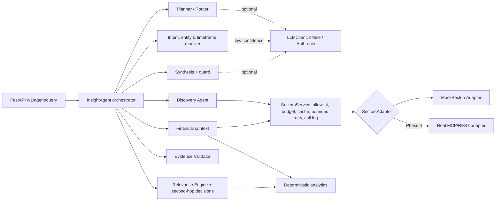

# IDX Insight Agent

An AI research and discovery assistant for Indonesian-listed companies, built on
[Sectors](https://sectors.app/) data for the SECTORS Hackathon 2026
(track: AI Agents & Assistants).

> **Core question:** *What should I pay attention to, and why does it matter?*

## Current Status

**Phases 0–3 implemented against deterministic mock data.** See
[PHASE.md](PHASE.md) — the project is currently until Phase 3.

| Area | State |
|---|---|
| Agent Brain (resolution, planning, discovery, relevance, second-hop) | Implemented |
| Deterministic analytics and evidence validation | Implemented |
| FastAPI backend | Implemented |
| Sectors data | **Mock only** — real MCP/REST adapter is Phase 4 |
| LLM | Offline deterministic runtime by default; optional Anthropic provider (not exercised against the live API in tests) |
| Frontend (Next.js) | Not started — Phase 5 |
| Deployment (Vercel) | Not started — Phase 5/6 |

## Project Purpose

Investors and analysts following IDX companies face a steady stream of
disclosures, corporate actions and quarterly reports. IDX Insight Agent helps
them decide what deserves attention and gives the factual financial context
behind it, with every claim traceable to Sectors data.

It is a research tool. It does **not** give buy/sell/hold recommendations and
does not trade.

## Product Concept

Our own design, inspired by two concepts in the official hackathon candidate
brief (it is not an official Sectors product or design):

- **Discovery** (inspired by Candidate 06): which disclosures and events matter
  for my watchlist, sector or timeframe?
- **Contextual analysis** (inspired by Candidate 05): what does the relevant
  financial data show for these companies?

The agent links the two: it discovers events, decides which are relevant,
decides whether deeper financial context is justified, retrieves and analyses
it, validates the evidence and explains the result.

## Agentic Workflow

The agent makes explicit, recorded decisions at each step:

1. **Resolve** companies (tickers, aliases, verified against Sectors), sector,
   timeframe and intent. Ambiguous companies trigger a clarification question
   instead of a guess; vague timeframes use a documented default recorded as an
   assumption.
2. **Plan**: choose steps for the intent (discovery, peer comparison, or
   single-company context). An LLM may propose the plan; a validator accepts it
   only if every step is allowed, required steps are present and the order is
   valid. Otherwise the rule-based plan is used.
3. **Discover** filings and corporate actions in scope, normalise them into
   events with evidence, and remove duplicates.
4. **Rank relevance** with deterministic rules (ownership change size,
   transaction value, insider trades, dividend/AGM dates, event clusters, watchlist).
5. **Decide second-hop research** per event: research, reuse, or skip, each
   with a reason (score threshold, per-request company cap, remaining tool budget).
6. **Analyse** deterministically: growth, spreads, peer medians and rankings,
   outliers, period alignment and unit normalisation.
7. **Validate evidence** for every claim before it can be stated.
8. **Synthesise** a briefing from accepted claims only. An LLM narrative is
   optional and is dropped if it contains advice language or numbers that are
   not in the validated facts.

Example trace for *"Apa saja disclosure yang perlu saya pantau minggu depan untuk sektor perbankan?"*:

```
Entities resolved → Intent resolved (discovery) → Timeframe resolved (2026-09-28 s/d 2026-10-04)
→ Plan selected → Discovery selected (7 companies) → Relevant events detected (7 of 9, 1 duplicate)
→ Second-hop analysis selected (BBNI, BBRI, BRIS) → Financial context retrieved
→ Evidence validated → Response synthesized
```

## Architecture



- **State**: `AgentState` is explicit and serializable; it holds intent,
  entities, timeframe, plan, events, second-hop decisions, evidence, metric
  values, claims, validation report, data gaps, recovery actions, tool calls and
  the trace.
- **Stateless requests**: each query gets its own `SectorsService` and state,
  which keeps the backend compatible with serverless deployment on Vercel.

```
backend/
  idx_insight/
    agent/       orchestrator, resolvers, planner, discovery, relevance,
                 financial context, analysis, validator, synthesis, prompts, state
    analytics/   numbers, periods, peers, events/relevance rules, metric catalog
    sectors/     adapter interface, schemas, mock adapter + fixtures, SectorsService
    llm/         LLMClient interface, offline runtime, Anthropic provider
    api/         FastAPI app, request/response schemas, service layer
    config.py    environment-driven settings
  tests/
```

## Data Source

Sectors (https://docs.sectors.app/). The adapter maps one method to each
documented MCP tool the agent uses:

| Adapter method | Sectors MCP tool |
|---|---|
| `get_filings` | `fetch-filings` |
| `get_corporate_actions` | `fetch-corporate-actions` |
| `get_quarterly_financials` | `fetch-quarterly-financials` |
| `get_quarterly_financial_dates` | `fetch-quarterly-financial-dates` |
| `get_company_report` | `fetch-company-report` |
| `list_subsectors` | `get-subsectors` |
| `list_companies` | `fetch-companies-by-subsector` |

Only metrics traceable to documented fields are computed (company report
ratios such as ROA, ROE, NIM, cost-to-income, CASA, LDR, CAR, and growth/ratios
derived from quarterly financials). Requests for undocumented metrics (e.g. NPL)
are reported as data gaps, not estimated.

## Mock vs Real Sectors Integration

Only `MockSectorsAdapter` exists. Its schemas follow the documented Sectors v2
response shapes (the BBCA Q1 2026 figures reuse the documentation example);
other values and all holder names are fictional. Setting
`SECTORS_DATA_MODE=real` returns HTTP 503 rather than faking data.

The mock deliberately includes: a late quarterly report (BBTN), an incomplete
report (BRIS Q2 2026), ratios reported in percent instead of fractions (BBNI),
missing metrics (CASA for BRIS/BTPS), stale-only data (BTPS), contradictory
growth figures (BMRI), a duplicated filing (BMRI), an empty corporate-actions
result (BTPS), an ambiguous alias ("bank syariah"), and injectable tool failures.

Open questions for Phase 4, marked `UNVERIFIED` in `sectors/schemas.py`:
the per-entry `year` key in `historical_financial_ratio`, the populated shape of
`upcoming_dividend`, and the response shape of the company-listing tool. No
documented tool provides upcoming financial-report dates; the agent states this
as a data gap.

## Implemented Features

- Intent resolution (discovery / peer comparison / company context / clarify),
  advice-request detection, metric bundles, unsupported-metric detection
- Entity resolution with Sectors verification, ambiguity handling and sector scope
- Timeframe resolution (ID/EN phrasing, ISO ranges, quarters, years, defaults)
- Guarded LLM planner with rule-based fallback
- Discovery of filings and corporate actions, normalisation, deduplication
- Deterministic relevance rules and recorded second-hop decisions
- Peer comparison with period alignment, unit normalisation, spreads, medians,
  rankings and robust outlier detection
- Evidence validation: missing source, wrong company, wrong period, unsupported
  metric, contradictory values, insufficient evidence, stale data, calculation
  without inputs
- Bounded recovery: clarification, default timeframes, one widened filing
  window, prior-year re-query, bounded retries, tool-call budget
- Grounded synthesis with a non-advice boundary note
- FastAPI: `GET /health`, `GET /v1/capabilities`, `POST /v1/agent/query`

## Testing

```bash
python -m venv .venv
.venv/Scripts/pip install -e "backend[dev,llm]"     # macOS/Linux: .venv/bin/pip
cd backend
../.venv/Scripts/python -m pytest -q
```

123 tests cover agent decisions (resolution, planning, discovery, relevance,
second-hop, recovery), analytics, evidence validation, the Sectors service and
mock adapter, the LLM runtime (with a fake client, no network) and the API contract.

Run the API locally:

```bash
cd backend
../.venv/Scripts/python -m uvicorn idx_insight.api.app:app --reload
curl -X POST localhost:8000/v1/agent/query -H "content-type: application/json" \
  -d '{"query": "Bandingkan BBCA, BBRI, BMRI, dan BBNI dari sisi profitability dan efficiency"}'
```

Configuration is read from environment variables; see `.env.example`.

## Known Limitations

- All data is mock data; nothing has been validated against the live Sectors API.
- The Anthropic provider is unit-tested with a fake client only.
- Entity aliases cover the mock universe; broader name matching needs the real
  company listing (Phase 4).
- Relevance weights and thresholds are initial heuristics and need tuning on real data.
- Briefings are in Indonesian; the API has no authentication or rate limiting yet.

## Remaining Work

Phases 4–7 in [PHASE.md](PHASE.md): real Sectors integration, the Next.js UI,
Vercel deployment and end-to-end validation, and demo/submission materials.
