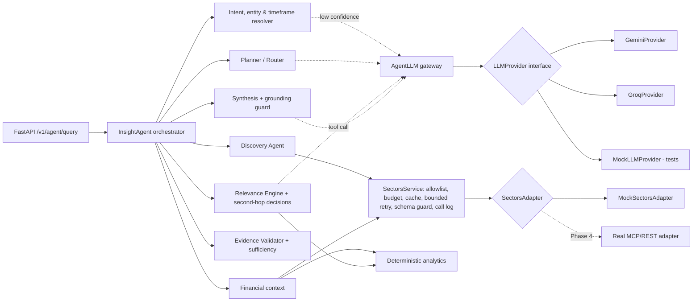

# IDX Insight Agent

An AI research and discovery assistant for Indonesian-listed companies, built on
[Sectors](https://sectors.app/) data for the SECTORS Hackathon 2026
(track: AI Agents & Assistants).

> **Core question:** *What should I pay attention to, and why does it matter?*

## Current Status

**Phases 0–3 implemented against deterministic mock data.** See
[PHASE.md](PHASE.md) — the project is currently until Phase 3.

| Area | State |
|---|---|
| Agent Brain (resolution, planning, discovery, relevance, second-hop) | Implemented |
| Deterministic analytics, evidence validation and sufficiency assessment | Implemented |
| FastAPI backend | Implemented |
| Sectors data | **Mock only** — real MCP/REST adapter is Phase 4 |
| Runtime LLM | Provider-agnostic interface; Gemini and Groq providers implemented and unit-tested against recorded HTTP shapes, **not yet exercised against the live APIs**; default is rules-only (no LLM) |
| Final LLM provider/model | **Not decided** |
| Frontend (Next.js) | Not started — Phase 5 |
| Deployment (Vercel) | Not started — Phase 5/6 |

## Project Purpose

Investors and analysts following IDX companies face a steady stream of
disclosures, corporate actions and quarterly reports. IDX Insight Agent helps
them decide what deserves attention and gives the factual financial context
behind it, with every claim traceable to Sectors data.

It is a research tool. It does **not** give buy/sell/hold recommendations and
does not trade.

## Product Concept

Our own design, inspired by two concepts in the official hackathon candidate
brief (it is not an official Sectors product or design):

- **Discovery** (inspired by the IDX Disclosure Calendar candidate): which
  disclosures and events matter for my watchlist, sector or timeframe?
- **Contextual analysis** (inspired by the Peer Lens for IDX Banks candidate):
  what does the relevant financial data show for these companies?

The agent links the two: discover what deserves attention, then investigate why
it matters using relevant contextual data.

## Agentic Workflow

The agent makes explicit, recorded decisions at each step:

1. **Resolve** companies (tickers, aliases and watchlist, verified against
   Sectors with a bounded number of calls), sector, timeframe and intent.
   Ambiguous companies trigger a clarification question instead of a guess;
   vague timeframes use a documented default recorded as an assumption. The LLM
   is consulted for intent only when the rules are unsure.
2. **Plan**: choose steps for the intent (discovery, peer comparison or
   single-company context). The LLM may propose the plan; code accepts it only
   if every step is allowed, required steps are present and the order is valid.
3. **Discover** filings and corporate actions in scope, normalise them into
   events with evidence, and remove duplicates.
4. **Rank relevance** with deterministic rules (ownership-change size,
   transaction value, insider trades, dividend/AGM dates, event clusters, watchlist).
5. **Decide second-hop research**: the LLM is offered a
   `request_financial_context` tool listing the relevant events and calls it
   for the events whose significance needs financial context. Code enforces the
   guards (only listed events, per-request company cap, remaining tool budget,
   reuse). Without an LLM, a score threshold decides. Every decision is recorded
   with its reason and source (`llm` or `rules`).
6. **Analyse** deterministically: growth, spreads, peer medians and rankings,
   outliers, period alignment and unit normalisation.
7. **Validate evidence** for every claim, then **assess sufficiency**:
   `sufficient`, `partial` or `insufficient`, listing incomplete, conflicting,
   unavailable and malformed data separately.
8. **Synthesise** a briefing from accepted claims only. An LLM narrative is
   optional and is dropped if it contains advice language or numbers that are
   not in the validated facts.

Bounded recovery happens where the problem appears: at most one retry per
Sectors call, one widened filing window when results are empty, a prior-year
re-query for missing comparison quarters, a per-request tool-call budget, and a
cap of four LLM calls per request.

Example trace for *"Apa saja disclosure yang perlu saya pantau minggu depan untuk sektor perbankan?"* (rules-only mode):

```
Entities resolved → Intent resolved (discovery) → Timeframe resolved (2026-09-28 s/d 2026-10-04)
→ Plan selected (rules) → Discovery selected (7 companies) → Relevant events detected (7 of 9, 1 duplicate)
→ Second-hop analysis selected (rules): BBNI, BBRI, BRIS → Financial context retrieved
→ Evidence validated (sufficient) → Response synthesized
```

## Architecture



- **Dependency direction** (enforced by `tests/test_architecture.py`): the
  Agent Brain imports only the LLM interface and neutral types, never a
  provider module or vendor SDK, and reaches Sectors only through
  `SectorsService`.
- **State**: `AgentState` is explicit and serializable; it holds intent,
  entities, timeframe, plan, events, second-hop decisions, evidence, metric
  values, claims, the validation report and assessment, data gaps, recovery
  actions, Sectors tool calls, LLM call records and the trace.
- **Stateless requests**: each query gets its own `SectorsService`, LLM gateway
  and state, which keeps the backend compatible with serverless deployment on Vercel.

```
backend/
  idx_insight/
    agent/       orchestrator, resolvers, planner, discovery, relevance/second-hop,
                 financial context, analysis, validator, synthesis, recovery,
                 llm_gateway, prompts, state
    analytics/   numbers, periods, peers, events/relevance rules, metric catalog
    sectors/     adapter interface, schemas, mock adapter + fixtures, SectorsService
    llm/         provider interface, neutral types, errors, structured output,
                 Gemini and Groq providers, shared HTTP transport, mock provider
    api/         FastAPI app, request/response schemas, service layer
    config.py    environment-driven settings
  tests/
```

## Data Source

Sectors (https://docs.sectors.app/). The adapter maps one method to each
documented MCP tool the agent uses:

| Adapter method | Sectors MCP tool |
|---|---|
| `get_filings` | `fetch-filings` |
| `get_corporate_actions` | `fetch-corporate-actions` |
| `get_quarterly_financials` | `fetch-quarterly-financials` |
| `get_quarterly_financial_dates` | `fetch-quarterly-financial-dates` |
| `get_company_report` | `fetch-company-report` |
| `list_subsectors` | `get-subsectors` |
| `list_companies` | `fetch-companies-by-subsector` |

Only metrics traceable to documented fields are computed (company report
ratios such as ROA, ROE, NIM, cost-to-income, CASA, LDR, CAR, and growth/ratios
derived from quarterly financials). Requests for undocumented metrics (e.g. NPL)
are reported as data gaps, not estimated. Responses that do not match the
documented shape are reported as malformed rather than crashing the agent.

## Mock vs Real Sectors Integration

Only `MockSectorsAdapter` exists. Its schemas follow the documented Sectors v2
response shapes (the BBCA Q1 2026 figures reuse the documentation example);
other values and all holder names are fictional. Setting
`SECTORS_DATA_MODE=real` returns HTTP 503 rather than faking data.

The mock deliberately includes: a late quarterly report (BBTN), an incomplete
report (BRIS Q2 2026), ratios reported in percent instead of fractions (BBNI),
missing metrics (CASA for BRIS/BTPS), stale-only data (BTPS), contradictory
growth figures (BMRI), a duplicated filing (BMRI), an empty corporate-actions
result (BTPS), an ambiguous alias ("bank syariah"), and injectable failures per
tool and symbol (a number of transient failures, `"always"`, or `"malformed"`).

Open questions for Phase 4, marked `UNVERIFIED` in `sectors/schemas.py`:
the per-entry `year` key in `historical_financial_ratio`, the populated shape of
`upcoming_dividend`, and the response shape of the company-listing tool. No
documented tool provides upcoming financial-report dates; the agent states this
as an informational gap.

## Runtime LLM

The product's runtime LLM is provider-agnostic and optional.

| `LLM_PROVIDER` | Behaviour |
|---|---|
| `none` (default) | No LLM calls; every decision uses the deterministic policies |
| `gemini` | Google Gemini API, REST `models/{model}:generateContent` |
| `groq` | Groq API, REST chat completions |

- **Candidates under evaluation**: a Gemini Flash model (e.g. `gemini-3.8-flash`)
  and GPT-OSS 120B on Groq (`openai/gpt-oss-120b`). Neither is a final choice,
  and free-tier availability depends on each provider's current quotas and policies.
- **Switching providers** changes configuration only; the Agent Brain is not modified.
- **Structured output**: schemas are generated from Pydantic models in a
  strict-mode-compatible form (Gemini `responseFormat`, Groq `json_schema` with
  `strict: true`) and every reply is validated in our code. Malformed output is
  rejected and the decision falls back to the rules.
- **Tool calling**: provider tool-call formats are normalised to `LLMToolCall`;
  arguments are schema-validated before the agent acts on them.
- **Errors** are normalised (`configuration`, `authentication`, `rate_limit`,
  `timeout`, `unavailable`, `invalid_request`, `malformed_response`,
  `invalid_structured_output`). No request is retried against a different
  provider; a misconfigured provider makes the API return 503.
- **Observability**: each call is recorded with purpose, provider, model,
  status, latency and token usage (no prompts, replies or keys), exposed as
  `llm_calls` in the API response and logged under `idx_insight.llm`.
- **Mock mode**: `MockLLMProvider` scripts structured replies, tool calls, text
  and failures per purpose, so tests need no API key, quota or network.

## Configuration

All settings come from environment variables (see `.env.example`):

| Variable | Purpose |
|---|---|
| `SECTORS_DATA_MODE` | `mock` (only implemented mode) |
| `SECTORS_API_KEY` | reserved for Phase 4 |
| `LLM_PROVIDER` | `none`, `gemini` or `groq` |
| `LLM_MODEL` | model id; required for `gemini`/`groq`, no built-in default |
| `GEMINI_API_KEY` / `GROQ_API_KEY` | key for the selected provider |
| `LLM_TIMEOUT_SECONDS` | per-call timeout (default 20) |
| `LLM_TEMPERATURE` | optional; provider default when empty |
| `LLM_MAX_OUTPUT_TOKENS` | output cap (default 4096) |
| `AGENT_MAX_TOOL_CALLS` / `AGENT_MAX_SECOND_HOP` / `AGENT_MAX_REQUERIES` | agent bounds |

## Implemented Features

- Intent resolution (discovery / peer comparison / company context / clarify),
  advice-request detection, metric bundles, unsupported-metric detection
- Entity resolution with bounded Sectors verification, ambiguity handling and sector scope
- Timeframe resolution (ID/EN phrasing, ISO ranges, quarters, years, defaults)
- Guarded LLM planner and LLM-selected second-hop research, both with rule fallbacks
- Discovery of filings and corporate actions, normalisation, deduplication
- Deterministic relevance rules
- Peer comparison with period alignment, unit normalisation, spreads, medians,
  rankings and robust outlier detection
- Evidence validation (missing source, wrong company, wrong period, unsupported
  metric, contradictory values, insufficient evidence, stale data, calculation
  without inputs) and an evidence sufficiency assessment
- Bounded recovery (see Agentic Workflow)
- Grounded synthesis with a non-advice boundary note
- FastAPI: `GET /health`, `GET /v1/capabilities`, `POST /v1/agent/query`

## Testing

```bash
python -m venv .venv
.venv/Scripts/pip install -e "backend[dev]"     # macOS/Linux: .venv/bin/pip
cd backend
../.venv/Scripts/python -m pytest -q
../.venv/Scripts/ruff check idx_insight tests
```

192 deterministic tests cover agent decisions (resolution, planning, discovery,
relevance, second-hop with and without an LLM, recovery), analytics, evidence
validation and sufficiency, the Sectors service and mock adapter, the LLM layer
(Gemini/Groq request and response normalisation through a fake HTTP transport,
structured output, tool calls, error normalisation, configuration), dependency
direction, and the API contract. No test needs an API key or network access.

Run the API locally:

```bash
cd backend
../.venv/Scripts/python -m uvicorn idx_insight.api.app:app --reload
curl -X POST localhost:8000/v1/agent/query -H "content-type: application/json" \
  -d '{"query": "Bandingkan BBCA, BBRI, BMRI, dan BBNI dari sisi profitability dan efficiency"}'
```

## Known Limitations

- All data is mock data; nothing has been validated against the live Sectors API.
- The Gemini and Groq providers have not been run against the live APIs; request
  and response shapes follow the official documentation and are covered by tests
  with recorded payloads. Groq strict structured output only works on models Groq
  lists as supporting it.
- Prompts have not been evaluated against real models yet.
- Entity aliases cover a small set of companies; broader name matching needs the
  real company listing (Phase 4).
- Relevance weights and thresholds are initial heuristics and need tuning on real data.
- Briefings are in Indonesian; the API has no authentication or rate limiting yet.

## Remaining Work

Phases 4–7 in [PHASE.md](PHASE.md): real Sectors integration, the Next.js UI,
Vercel deployment and end-to-end validation (including live evaluation and
selection of the runtime LLM provider), and demo/submission materials.
